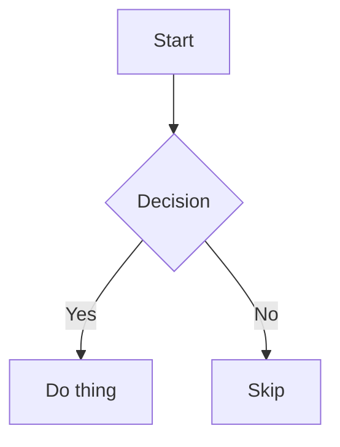

# Mermaid System

Build-time diagram rendering for MDX content. Diagrams are written as fenced code blocks in MDX and rendered to static inline SVGs during `npm run build`. Zero Mermaid JS shipped to the browser.

## How It Works

```
MDX: ```mermaid ... ```
  → Shiki skips it (excludeLangs: ['mermaid'])
  → rehype-mermaid (Playwright renders SVG with dark theme + Chakra Petch font)
  → HTML: inline <svg> element in the page DOM
  → Deploy: static HTML, 0KB Mermaid JS
  → Browser: SVG inherits page fonts via @font-face
```

## Installation

Two steps: npm packages + browser binary:

```bash
# 1. Install npm packages
npm install rehype-mermaid playwright

# 2. Download Chromium binary (~150MB, one-time per machine)
npx playwright install --with-deps chromium
```

The Chromium binary is stored in `~/.cache/ms-playwright/`, not in `node_modules`. It persists across projects. If you move to a new machine or wipe `~/.cache`, run step 2 again.

## Configuration

### astro.config.mjs

```js
import rehypeMermaid from 'rehype-mermaid';

export default defineConfig({
  markdown: {
    rehypePlugins: [
      rehypeKatex,
      [rehypeMermaid, {
        strategy: 'inline-svg',
        mermaidConfig: {
          theme: 'dark',
          fontFamily: '"Chakra Petch", sans-serif',
        },
      }],
    ],
    syntaxHighlight: {
      type: 'shiki',
      excludeLangs: ['mermaid'],
    },
  },
});
```

Key config points:
- `strategy: 'inline-svg'` renders SVGs directly in the DOM (not inside `` tags), so they inherit page fonts and CSS
- `theme: 'dark'` generates diagrams with dark backgrounds and light text, matching the site's dark-first design
- `fontFamily` sets Chakra Petch as the diagram font; because SVGs are inline, the browser loads it via the page's `@font-face`
- `excludeLangs: ['mermaid']` prevents Shiki from syntax-highlighting mermaid blocks before rehype-mermaid processes them

### Theme Approach

Diagrams use the mermaid `dark` theme, which gives them dark node backgrounds with light text. This looks native on the dark site theme and provides good contrast on the light theme. No JS-based theme sync is needed; a single SVG works for both site themes.

## Usage in MDX

Write a fenced code block with language `mermaid`:

````mdx

````

**Mobile tip:** Use `flowchart TD` (top-down) instead of `flowchart LR` (left-right) for diagrams that will be viewed on mobile. Vertical layouts scale down gracefully; horizontal layouts become unreadable on narrow screens. Keep node text short.

## Supported Diagram Types

All standard Mermaid diagram types work:

- **Flowchart**: `graph TD` / `graph LR`
- **Sequence**: `sequenceDiagram`
- **ER Diagram**: `erDiagram`
- **State**: `stateDiagram-v2`
- **Class**: `classDiagram`
- **Gantt**: `gantt`
- **Pie**: `pie`
- **Mindmap**: `mindmap`
- **Timeline**: `timeline`

## Styling

Mermaid diagram styles are in `src/styles/global.css` under the `Mermaid Diagrams` section. Inline SVGs are targeted via `.content__body > svg[id^="mermaid-"]` and promoted to the `--w-wide` width tier so they have room to breathe on desktop.

## Troubleshooting

### Diagrams render as code blocks
Shiki is processing the mermaid block before rehype-mermaid. Ensure `excludeLangs: ['mermaid']` is set in the `syntaxHighlight` config.

### Playwright not found
Run `npx playwright install --with-deps chromium` to download the browser binary.

### Font not applied
With `inline-svg` strategy, diagrams inherit page fonts. If Chakra Petch is not loading, check that the `@font-face` declarations in the page CSS are correct and the font files are accessible.

### Build is slow
Playwright startup adds ~2-3 seconds. Each diagram adds minimal time. This is a one-time build cost; users get instant static SVGs.
