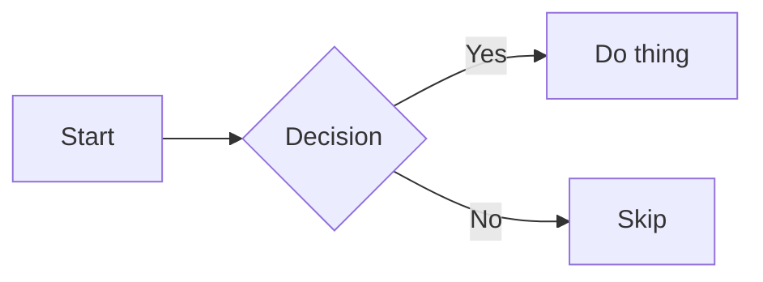

# Mermaid System

Build-time diagram rendering for MDX content. Diagrams are written as fenced code blocks in MDX and rendered to static SVGs during `npm run build`. Zero Mermaid JS shipped to the browser.

## How It Works

```
MDX: ```mermaid ... ```
  → Shiki skips it (excludeLangs: ['mermaid'])
  → rehype-mermaid (Playwright renders 2 SVGs: light + dark)
  → HTML: <picture> with <source> (dark) +  (light)
  → Deploy: static HTML, 0KB Mermaid JS
  → Browser: data-theme toggle → JS swaps visible SVG
```

## Installation

Two steps — npm packages + browser binary:

```bash
# 1. Install npm packages
npm install rehype-mermaid playwright

# 2. Download Chromium binary (~150MB, one-time per machine)
npx playwright install --with-deps chromium
```

The Chromium binary is stored in `~/.cache/ms-playwright/`, not in `node_modules`. It persists across projects. If you move to a new machine or wipe `~/.cache`, run step 2 again.

## Configuration

### astro.config.mjs

```js
import rehypeMermaid from 'rehype-mermaid';

export default defineConfig({
  markdown: {
    rehypePlugins: [
      rehypeKatex,
      [rehypeMermaid, { strategy: 'img-svg', dark: true }],
    ],
    syntaxHighlight: {
      type: 'shiki',
      excludeLangs: ['mermaid'],
    },
  },
});
```

Key config points:
- `strategy: 'img-svg'` — renders SVGs inside `` tags (not inline SVG)
- `dark: true` — generates both light and dark theme SVGs
- `excludeLangs: ['mermaid']` — prevents Shiki from syntax-highlighting mermaid blocks before rehype-mermaid can process them

### Theme Sync

rehype-mermaid generates `<picture>` elements with `<source media="(prefers-color-scheme: dark)">`. Since the site uses `data-theme` attribute toggling (not OS-level `prefers-color-scheme`), a script in BaseLayout syncs the `<source>` media attribute on theme changes:

1. On page load (`astro:page-load`), marks mermaid `<source>` elements with `data-mermaid="dark"`
2. Sets `source.media` to `'all'` (dark theme) or `'not all'` (light theme) based on current `data-theme`
3. Listens for `theme-change` events from the toggle button

## Usage in MDX

Write a fenced code block with language `mermaid`:

````mdx

````

## Supported Diagram Types

All standard Mermaid diagram types work:

- **Flowchart**: `graph TD` / `graph LR`
- **Sequence**: `sequenceDiagram`
- **ER Diagram**: `erDiagram`
- **State**: `stateDiagram-v2`
- **Class**: `classDiagram`
- **Gantt**: `gantt`
- **Pie**: `pie`
- **Mindmap**: `mindmap`
- **Timeline**: `timeline`

## Styling

Mermaid diagram styles are in `src/styles/global.css` under the `Mermaid Diagrams` section. The `<picture>` elements are targeted via `picture:has(> source[media*="prefers-color-scheme"])`.

## Troubleshooting

### Diagrams render as code blocks
Shiki is processing the mermaid block before rehype-mermaid. Ensure `excludeLangs: ['mermaid']` is set in the `syntaxHighlight` config.

### Playwright not found
Run `npx playwright install --with-deps chromium` to download the browser binary.

### Theme doesn't switch
The `syncMermaidTheme()` function in BaseLayout handles this. It marks `<source>` elements with `data-mermaid="dark"` on first run, then uses that marker for subsequent toggles. If diagrams show wrong theme, check that the theme toggle dispatches a `theme-change` event on `window`.

### Build is slow
Playwright startup adds ~2-3 seconds. Each diagram adds minimal time. This is a one-time build cost — users get instant static SVGs.
