> This doc builds the mental model from first principles: renderer architecture, the event loop,
> tasks vs microtasks, the input pipeline, what `isInputPending` actually queries,
> long tasks + Interaction to Next Paint (INP), and `scheduler.yield()` mechanics, culminating in why the
> common "yield only on input pending" pattern is broken and what the correct pattern looks like.
>
> Every claim has been validated against authoritative sources (HTML/Web Incubator Community Group (WICG)/World Wide Web Consortium (W3C) specs,
> Chromium design docs, Mozilla Developer Network (MDN), web.dev). Diagrams throughout. Read top-to-bottom.

---

## Foundation 1: Renderer Process & Threads

### 1.1 A tab is not (always) one process

Pre-2018: one tab maps to one renderer process. From Chrome 67 with **Site Isolation** enabled by default on desktop (Windows, macOS, Linux, Chrome OS), each *site* gets its own renderer process. A "site" is defined as scheme plus registrable domain (the public suffix plus one label, often called eTLD+1): `https://example.com` is one site, and subdomains, port, and path are ignored, so `https://foo.example.com:8080` collapses into the same site as `https://example.com`. A page with cross-site iframes spans multiple renderer processes, glued together by **Out-of-Process Iframes (OOPIFs)**. _Source: [Site Isolation design doc, Chromium](https://www.chromium.org/Home/chromium-security/site-isolation/); [Site Isolation for web developers, Chrome for Developers](https://developer.chrome.com/blog/site-isolation)._

On Android the policy is narrower because memory is tight: rather than isolating every site, Chrome isolates only a subset. On devices with at least 2 GB of RAM, sites that users log into have been isolated since Chrome 77, and Chrome 92 extended this to sites that use third-party OAuth sign-in and sites that set a `Cross-Origin-Opener-Policy` header. So on Android, a renderer process can still host multiple non-isolated sites. _Source: [Site Isolation design doc, Chromium](https://www.chromium.org/Home/chromium-security/site-isolation/)._

> **Quick glossary for the diagram below:**
> - **Mojo**: Chromium's internal message-passing system between processes (think gRPC for the browser).
> - **Viz**: the GPU service process that draws the final pixels.
> - **OOPIF**: an `<iframe>` whose document lives in a different OS process from its parent; invisible to the page, decisive for scheduling because each renderer process has its own main thread.
> - **Inter-Process Communication (IPC)**: message-passing between two OS processes (browser to renderer to GPU). Each hop costs microseconds.

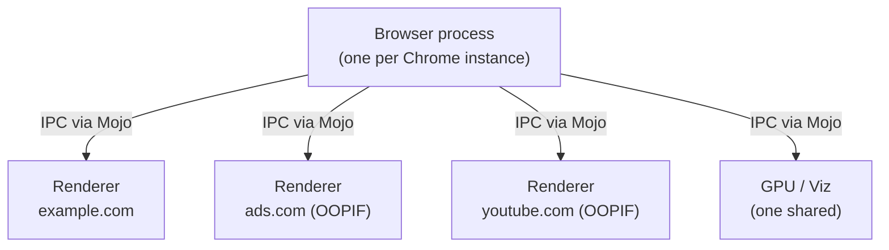

This means a content script running in the main frame and one running in a cross-origin iframe live in **different renderer processes** with **different main threads**. They communicate only via `postMessage`. This isn't directly relevant to scheduling, but it explains why `isInputPending` should be gated to the main frame: the function returns false for input targeting cross-origin iframes by design (Foundation 5).

> **⏱ Timings, 1.1:**
> - **Cross-process Mojo Inter-Process Communication (IPC), browser to renderer (one-way)**: **10 to 20 µs** best case (IO-thread bound); **few µs to several ms** typical; under load, can stretch into seconds. Exceeding: input lag, delayed requestAnimationFrame (rAF), missed frame deadline, jank. _Source: [Chromium Mojo Inter-Process Communication (IPC) latency thread](https://groups.google.com/a/chromium.org/g/chromium-mojo/c/UqpPXz_wp28) (no ref / estimate only, partial)._
> - **Out-of-Process Iframe (OOPIF) renderer process spawn**: spawn cost **~50 to 200 ms** (no ref / estimate only); steady-state memory **~30 to 50 MB private** per renderer; one process per cross-site frame at peak isolation. Exceeding: tab/iframe load latency; on low-RAM Android devices only a subset of sites are isolated to reduce overhead. _Source: [Site Isolation design doc, Chromium](https://www.chromium.org/Home/chromium-security/site-isolation/)._
> - **Cross-frame `postMessage` round-trip (same browser)**: **~few hundred µs** when both renderers idle (no ref / estimate only).
> - **Total: cross-process input or postMessage hop**: **~10 µs to a few ms** under healthy load.

### 1.2 Inside one renderer

A renderer process runs many threads. The main thread is one of them, but most discussion treats it as "the thread" because it owns the Document Object Model (DOM), JavaScript (JS), and most of the rendering pipeline.

> **If you only remember one thing from the diagram below:** **the main thread is where everything you write runs**: your JS, your event handlers, DOM mutations, layout. The other threads exist to keep the main thread free for that work. They matter for understanding *why* something runs on the main thread, not what.

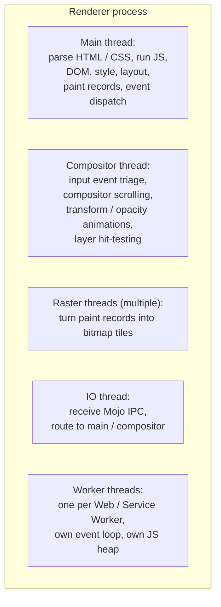

A typical renderer in 2026 has roughly a dozen threads. **Only the main thread runs page JavaScript (JS), Document Object Model (DOM), layout, and event dispatch.** Workers are off-main-thread but completely separate JavaScript (JS) contexts: a Web Worker has its own event loop and its own JS heap, and it reaches the page only through `postMessage`, so it can never touch the DOM directly.

> **⏱ Timings, 1.2:**
> - **Main thread layout pass**: **&lt;1 ms** incremental; **5 to 10 ms** moderately complex page (news article, GitHub diff); **tens to hundreds of ms** worst case. Exceeding: blocks paint+commit, frame missed; at 120 Hz the entire 8.33 ms budget is gone. _Source: [Browser Rendering Guide 2026](https://abdallahzakzouk.com/blog/browser-rendering-performance-guide); [RenderingNG](https://developer.chrome.com/docs/chromium/renderingng-architecture)._
> - **Main thread paint record generation**: **&lt;1 ms** incremental; **few ms** moderate page; **tens of ms** worst case. Exceeding: delays commit to compositor, frame slips. _(no ref / estimate only)_
> - **Compositor thread per-frame work**: **~1 to 4 ms** typical (scroll, transform/opacity animation, layerization). Exceeding: scroll/animation jank even when main thread is idle. _(no ref / estimate only)_
> - **Raster thread per-tile generation**: **~1 to 10 ms per tile** Graphics Processing Unit (GPU) raster; bad cases **300 ms+** for a full new tile set. Exceeding: blank/checkerboard tiles on fast scroll. _Source: [Introducing Skia Graphite, Chromium Blog Jul 2025](https://blog.chromium.org/2025/07/introducing-skia-graphite-chromes.html)._
> - **Graphics Processing Unit (GPU)/Viz frame display (aggregate + draw + swap)**: **~1 to 3 ms** typical, plus one v-sync wait. Exceeding: missed v-sync, display held for another refresh. _(no ref / estimate only)_
> - **V8 Garbage Collection (GC), minor (Scavenger)**: **sub-ms to ~5 ms** typical, parallel scavenge sub-ms common. Exceeding: dropped animation frames. _Source: [The last couple years in V8's Garbage Collection (GC), wingolog Nov 2025](https://wingolog.org/archives/2025/11/13/the-last-couple-years-in-v8s-garbage-collector)._
> - **V8 Garbage Collection (GC), major (Mark-Compact, concurrent + incremental)**: main-thread finalization **~5 to 30 ms** typical; **50 to 200 ms** on large heaps with many live objects. Exceeding: dropped frames + Interaction to Next Paint (INP) regression spikes. _Source: [Why Your React App Feels Slow, V8 Garbage Collection (GC) & Interaction to Next Paint (INP), 2026](https://dailydevpost.com/blog/v8-garbage-collector-react-performance)._
> - **Total: one full frame budget**: **16.67 ms @ 60 Hz**, **8.33 ms @ 120 Hz**, **~4.17 ms @ 240 Hz**.

### 1.3 RenderingNG: 12-stage pipeline

**Why this matters in one sentence:** every visible UI update goes through this 12-stage pipeline, and the main-thread half competes with your JavaScript for the same thread. If your JS runs long, the pipeline can't start the next stage; that's where dropped frames come from.

For background only: Chromium's "RenderingNG" architecture splits the path from "Document Object Model (DOM) mutation" to "pixels on screen" into 12 stages: 1 animate, 2 style, 3 layout, 4 pre-paint, 5 scroll, 6 paint, 7 commit, 8 layerize, 9 raster, 10 activate, 11 aggregate, 12 draw. The main thread runs animate, style, layout, pre-paint, paint, and commit (stages 1 to 4 and 6 to 7). **Stage 5 (scroll) runs on the compositor thread**, which is what enables smooth scrolling while the main thread is busy; the compositor thread also handles stages 8 (layerize) and 10 (activate), and it can run animate as well for transform/opacity animations. Stage 9 (raster), stage 11 (aggregate), and stage 12 (draw) run in the Graphics Processing Unit (GPU) "Viz" process that draws the actual pixels. _Source: [RenderingNG architecture, Chrome for Developers](https://developer.chrome.com/docs/chromium/renderingng-architecture)._

You don't need to memorise this. The point is: when we say "the main thread is busy," it could be busy doing JavaScript (JS), or doing layout, or doing paint-record generation, all of which prevent the next task from being picked. Note the corollary that the compositor ownership of scroll and transform/opacity animation implies: those visual effects can keep moving at the display's refresh rate even while a long task hogs the main thread, which is exactly why a janky page can still scroll smoothly until you try to interact with it.

> **⏱ Timings, 1.3:**
> - **Frame budget @ 60 Hz**: **16.67 ms** total across all 12 stages. Exceeding: dropped frame, visible stutter. _Source: [Browser Rendering Guide 2026](https://abdallahzakzouk.com/blog/browser-rendering-performance-guide)._
> - **Frame budget @ 120 Hz**: **8.33 ms** total. Exceeding: same as above with twice the visibility. _Source: same._
> - **Long Task threshold**: **50 ms**. Exceeding: surfaced via Long Tasks Application Programming Interface (API); main thread blocked, input delay risk. _Source: [Long Tasks Application Programming Interface (API) World Wide Web Consortium (W3C) Editor's Draft 2026-03-19](https://w3c.github.io/longtasks/)._
> - **Long Animation Frame (LoAF) threshold**: **50 ms**. Exceeding: frame flagged via Long Animation Frames (LoAF) Application Programming Interface (API) with per-script attribution (`sourceURL`, `blockingDuration`, etc.). _Source: [Long Animation Frames Application Programming Interface (API), developer.chrome.com 2024-10-14](https://developer.chrome.com/docs/web-platform/long-animation-frames)._
> - **Total: any frame should fit in the budget**; if any single stage exceeds the frame budget, that frame drops.

> **Sources**: [HyperText Markup Language (HTML) §8.1.7](https://html.spec.whatwg.org/multipage/webappapis.html#event-loops); [Site Isolation design doc](https://www.chromium.org/Home/chromium-security/site-isolation/); [RenderingNG architecture](https://developer.chrome.com/docs/chromium/renderingng-architecture); [Inside look at modern web browser, part 3, Mariko Kosaka](https://developer.chrome.com/blog/inside-browser-part3).

---

## Foundation 2: The HyperText Markup Language (HTML) Event Loop

### 2.1 The processing model

Per HyperText Markup Language (HTML) §8.1.7.3 "Event loop processing model," the main thread runs forever in this loop:

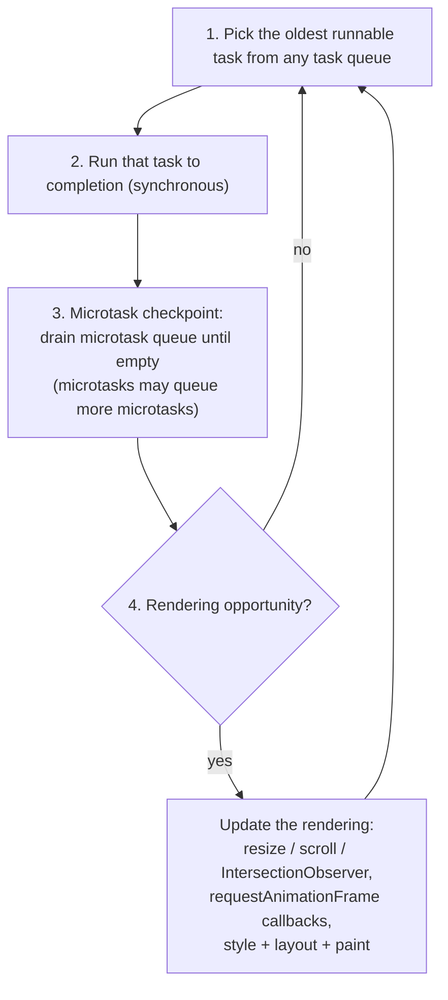

Three **iron rules** that the rest of this doc depends on:

1. **One task per iteration.** The loop picks one task at step 1 and runs it. Other tasks wait.
2. **Tasks run to completion.** Once step 2 begins, nothing on the main thread interrupts it: no paint, no input dispatch, no animation frame, until the task returns. This is cooperative scheduling, not preemptive; a 200 ms task means 200 ms with zero paints and zero input handlers, no matter how many clicks arrive in that window.
3. **"Rendering opportunity" is browser-decided.** Not every iteration paints. Chrome aligns to the display refresh rate (60 Hz on most screens, 120 Hz on some). Backgrounded tabs don't paint at all, so step 4 is skipped entirely.

> **⏱ Timings, 2.1:**
> - **"Pick next task" dispatch overhead**: **~5 to 50 µs** (no ref / estimate only, Blink scheduler internals not publicly benchmarked in window). Exceeding: dominates throughput on event-heavy pages with tiny tasks.
> - **Microtask checkpoint, 0 items**: **&lt;1 µs** (queue-empty check). _Source: [User Interface (UI) Blocking behaviour: microtasks vs macrotasks, DEV 2024](https://dev.to/tusharshahi/ui-blocking-behaviour-microtasks-vs-macrotasks-4en1)._
> - **Microtask checkpoint, 10 items**: **~10 to 50 µs**.
> - **Microtask checkpoint, 100 items**: **~100 µs to 1 ms**. Exceeding: rendering and next task blocked; chained microtasks lead to indefinite User Interface (UI) freeze.
> - **Total: one event-loop iteration on idle main thread**: **~10 to 100 µs** typical (dispatch + tiny task + microtask drain).

### 2.2 What's a "task"?

A task is a queued unit of work. It comes from a **task source**. HyperText Markup Language (HTML) names many task sources:

- **Timer task source**: `setTimeout`, `setInterval` callbacks
- **Document Object Model (DOM) manipulation task source**: `MessageChannel.postMessage`, async Document Object Model (DOM) events
- **User interaction task source**: events queued in response to user input (per HyperText Markup Language (HTML); the practical input-dispatch path has more to it, see Foundation 4)
- **Networking task source**: `fetch` resolution, XHR completion
- **History traversal task source**: `popstate`, `hashchange`
- **Idle task source**: `requestIdleCallback`
- **Per-Application Programming Interface (API) task sources**: IntersectionObserver, performance timeline, etc.

Task source matters because **throttling rules are per-source**. The 4 ms clamp on `setTimeout(0)` after 5 nested calls applies *only* to the timer task source. `MessageChannel.postMessage` lives on the Document Object Model (DOM) manipulation source: no clamp. This is why React's scheduler uses `MessageChannel` instead of `setTimeout(0)`; it wants a true zero-delay task that the browser will not throttle.

> **⏱ Timings, 2.2:**
> - **`setTimeout(fn, 0)` minimum delay (first 4 nested calls)**: **~0 to 1 ms** (the first four nested calls fire at approximately 0 ms). _Source: [setTimeout(), MDN](https://developer.mozilla.org/en-US/docs/Web/API/setTimeout)._
> - **`setTimeout(fn, 0)` once a nested call has been scheduled 5 times (clamp engaged)**: **4 ms** minimum. Exceeding: ~250 Hz ceiling on chained `setTimeout(0)` loops; React abandoned this for MessageChannel for exactly this reason. _Source: [HyperText Markup Language (HTML) Standard §timers](https://html.spec.whatwg.org/multipage/timers-and-user-prompts.html) (normative); [setTimeout(), MDN](https://developer.mozilla.org/en-US/docs/Web/API/setTimeout)._
> - **`MessageChannel.postMessage(null)` round-trip**: **~50 to 200 µs** typical. Unaffected by the 4 ms clamp. _Source: [Understanding MessageChannel Scheduling in React, Oreate AI 2024](https://www.oreateai.com/blog/understanding-messagechannel-scheduling-in-react-a-deep-dive/ffc72cb4baee435b40588fa2b7397312); [React PR #14249](https://github.com/facebook/react/pull/14249)._
> - **`requestAnimationFrame` callback dispatch overhead**: **~10 to 100 µs**. Frame cadence: 16.67 ms @ 60 Hz, 8.33 ms @ 120 Hz. Callback budget: **&lt;10 ms** to leave room for layout+paint within the frame. _Source: [Jank busting for better rendering, web.dev](https://web.dev/speed-rendering/); [requestAnimationFrame Application Programming Interface (API), sub-millisecond precision, Chrome dev blog 2024](https://developer.chrome.com/blog/requestanimationframe-api-now-with-sub-millisecond-precision)._
> - **`requestIdleCallback` deadline budget on idle 60 Hz page**: **up to 50 ms** (spec cap). _Source: [World Wide Web Consortium (W3C) requestIdleCallback spec](https://w3c.github.io/requestidlecallback/)._
> - **`requestIdleCallback` deadline on busy page**: **1 to 10 ms** typical, **near 0 ms** when the frame just finished heavy work. Exceeding: stealing from frame budget, next-frame jank. _Source: [Using requestIdleCallback, Chrome dev blog](https://developer.chrome.com/blog/using-requestidlecallback)._
> - **Total: typical "yield to event loop" cost**: **50 to 200 µs** (MessageChannel) vs **4 ms** worst-case (clamped setTimeout), a 20x difference.

### 2.3 Microtasks are not tasks

Microtasks are a separate queue, drained at step 3 of every iteration. Sources:

- `Promise.then / .catch / .finally` reactions
- `await` continuations (per ECMAScript, the resumption is enqueued as a Promise reaction, which is a microtask)
- `queueMicrotask(fn)`
- **MutationObserver** callbacks (the "compound microtask")
- `FinalizationRegistry` cleanup callbacks

Critical differences vs tasks:

| Property | Task | Microtask |
|---|---|---|
| Queue position in loop | step 1 (one per iteration) | step 3 (drain to empty) |
| Can yield to rendering | Yes (after task ends) | **No** (microtasks block paint) |
| Can yield to input | Yes (next task could be input) | **No** (input task waits) |
| Starvable | No (one per iteration is fair) | **Yes** (chained microtasks freeze the page) |

> ⚠ **`await Promise.resolve()` is NOT yielding to the browser.** It schedules a microtask. The microtask queue drains within the current loop iteration. No paint, no input dispatch happens between them. Use `setTimeout(0)`, `MessageChannel.postMessage(null)`, or `scheduler.yield()` for actual yield-to-loop semantics.

> **⏱ Timings, 2.3:**
> - **`queueMicrotask(fn)` queueing cost**: **~50 to 200 ns**. No allocation beyond the queue node. _Source: [queue-microtask shim README, feross 2024+](https://github.com/feross/queue-microtask)._
> - **`Promise.resolve().then(fn)` cost**: **~200 to 800 ns**. Roughly 3 to 5x slower than `queueMicrotask` because it allocates a Promise + reaction job + queue node. _Source: [In-Depth Guide to JavaScript's queueMicrotask, Bomberbot](https://www.bomberbot.com/javascript/an-in-depth-guide-to-javascripts-queuemicrotask-techniques-patterns-and-performance/)._
> - **`await` continuation overhead (already-resolved Promise)**: **~100 to 500 ns** for suspend+resume bookkeeping. Awaiting an already-resolved promise costs 1 microtick after the 2018 V8 change, down from a minimum of 3 before. _Source: [Faster async functions and promises, V8 blog](https://v8.dev/blog/fast-async) (canonical reference)._
> - **MutationObserver callback dispatch latency**: **~10 µs to 1 ms** depending on records-list size; coalescing means 1000 mutations produce 1 callback. _Source: [Behind the Curtain: MutationObserver Performance, fsjs.dev 2024](https://fsjs.dev/behind-the-curtain-mutationobserver-performance-optimization/)._
> - **Total: chained microtask starvation risk**: unbounded; a chained `Promise.then(...).then(...)` infinite loop is a full User Interface (UI) freeze.

### 2.4 When microtasks actually run

Folk wisdom: "microtasks run at end of task." More accurate: **microtasks run whenever the JavaScript (JS) execution stack empties.** Inside a single task, if a function returns and there's no caller above (the stack is empty), the spec performs a microtask checkpoint right there. That's why a `Promise.then` callback can fire mid-task in surprising places.

For chunking-and-yielding work, this detail rarely matters, but it explains why `await scheduler.yield()` reliably ends the current task: `await` empties the stack, the microtask checkpoint runs (queueing the continuation as a Promise resolution), and the current task ends.

> **⏱ Timings, 2.4:**
> - **Stack-empty microtask checkpoint**: **&lt;1 µs** (idle queue) to **~ms** (long queue). Same scaling as 2.1's checkpoint timings; fires whenever the JavaScript (JS) stack drains, not only at task end.

### 2.5 "Macrotask" is folk usage

The term "macrotask" appears in Mozilla Developer Network (MDN) copy and Jake Archibald's "In The Loop" talk. **It is not a spec term.** The HyperText Markup Language (HTML) spec uses "task." This doc uses "task."

> **Sources**: [HyperText Markup Language (HTML) Living Standard §8.1.7](https://html.spec.whatwg.org/multipage/webappapis.html#event-loops); [HyperText Markup Language (HTML) §8.6 Timers](https://html.spec.whatwg.org/multipage/timers-and-user-prompts.html); [Tasks, microtasks, queues and schedules, Jake Archibald](https://jakearchibald.com/2015/tasks-microtasks-queues-and-schedules/); [In depth: Microtasks, Mozilla Developer Network (MDN)](https://developer.mozilla.org/en-US/docs/Web/API/HTML_DOM_API/Microtask_guide/In_depth).

---

## Foundation 3: How Input Reaches Your JavaScript (JS) Handler

### 3.1 The route

A click does not jump straight from your finger to `onclick`. It travels:

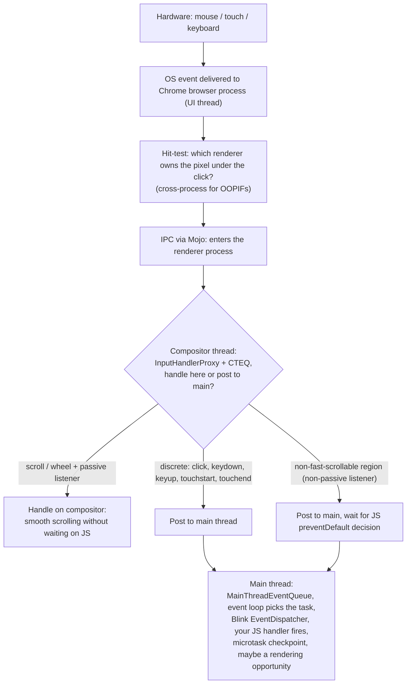

The browser-process hit-test answers a single question: which renderer process owns the pixel under the pointer? For a top-level page that is the page's own renderer; for cross-origin iframes (OOPIFs) it can be a different renderer process, which is why the hit-test sometimes crosses a process boundary. Only after the target renderer is known does the event cross into that renderer via a Mojo IPC, landing on the compositor thread first.

> **⏱ Timings, 3.1:**
> - **Operating System (OS) click delivery (Hardware (HW) → browser process):** **~1 to 8 ms** (Universal Serial Bus (USB) poll 1 to 8 ms at 125 to 1000 Hz; Operating System (OS) dispatch &lt; 1 ms). Exceeding: adds to Interaction to Next Paint (INP) input delay; uncontrollable from web platform. _(no ref / estimate only: browser-side measurement tools cannot reach below the Operating System (OS) boundary)._
> - **Browser → renderer compositor Inter-Process Communication (IPC) (Mojo):** **~0.1 to 2 ms** typical, up to **~5 ms** under load. Exceeding: bloats Interaction to Next Paint (INP) input delay; worsens with extension count. _(no ref / estimate only)._
> - **Compositor input triage (`InputHandlerProxy`):** **~50 to 500 µs** (sub-ms on healthy hardware). Exceeding: posts to main delayed → Interaction to Next Paint (INP) regression. _Source: [Chromium cc/input docs](https://chromium.googlesource.com/chromium/src/+/HEAD/cc/input/) (living)._
> - **Main thread input task dispatch (queue pickup → EventDispatcher start):** **~1 to 50 ms** depending on contention; **≥50 ms** triggers Long Animation Frames (LoAF) "blocking". Exceeding: ~18% of total Interaction to Next Paint (INP) on average per Chrome team. _Source: [Interaction to Next Paint (INP) breakdown, developer.chrome.com 2024](https://developer.chrome.com/docs/performance/insights/inp-breakdown)._
> - **JavaScript (JS) event handler ("processing duration"):** fast: **&lt;50 ms**; slow: **>200 ms** (already pushes a single interaction to "needs improvement"). Exceeding: counted directly in Interaction to Next Paint (INP); >50 ms qualifies the frame as a Long Animation Frame. _Source: [Interaction to Next Paint (INP), web.dev](https://web.dev/articles/inp); [Long Animation Frames (LoAF) Application Programming Interface (API), developer.chrome.com](https://developer.chrome.com/docs/web-platform/long-animation-frames)._
> - **Total: click → first JavaScript (JS) handler fire on healthy page:** **~5 to 30 ms** typical. _Source: [Interaction to Next Paint (INP) breakdown, developer.chrome.com 2024](https://developer.chrome.com/docs/performance/insights/inp-breakdown)._

### 3.2 Compositor thread vs main thread for input

This is the key surprise: **input first hits the compositor thread, not the main thread.** Two consequences:

- **Smooth scrolling while main is blocked.** A scroll wheel turn travels Operating System (OS) → browser → compositor. If no main-thread listener will preventDefault (that is, all wheel listeners are `passive: true`), the compositor scrolls the page itself, paints a new frame, and the user sees buttery-smooth scrolling even if the main thread is in a 5-second long task running JavaScript (JS). This is why `addEventListener('wheel', fn, { passive: true })` matters for jank. A passive listener is a promise to the browser that the handler will never call `preventDefault()`, so the compositor is free to scroll without waiting for it.
- **Click always goes to main.** Discrete events (`click`, `keydown`, `keyup`, `mousedown`, `mouseup`, `touchstart`, `touchend`) never have a compositor fast path *for handler dispatch*. They are always posted to the main thread. So clicks block on main-thread availability: a click that lands during a long task waits until that task finishes.

> **Two classifications, easy to confuse:** `touchstart`/`touchend` are "discrete" for `isInputPending()` classification (Foundation 4.2) but participate in the **compositor passive-listener fast path** for scroll-decision purposes: the compositor needs them to decide whether to start a scroll. If all touch listeners are `passive: true`, the compositor scrolls without waiting on main; otherwise it posts to main and waits for `preventDefault()`. `click`, `keydown`, `keyup`, `mousedown`, `mouseup` have no compositor fast path of any kind.

> **What's a "non-fast-scrollable region"?** A rectangle on the page that the compositor must NOT scroll on its own because some main-thread JS might want to call `preventDefault()` on the scroll. Attaching a non-passive `wheel`, `touchstart`, or `touchmove` listener to an element marks the element's bounding box as non-fast-scrollable. Chrome 56+ treats document-level touch listeners (those registered on `window`, `document`, or `body`) as `passive: true` by default, and Chrome 73+ does the same for `wheel` and `mousewheel` on those same root targets, so most pages get the compositor fast path automatically. To opt back out and keep the ability to call `preventDefault()` on a root target, you must pass `{ passive: false }` explicitly. DevTools → Rendering → "Scrolling performance issues" highlights non-fast-scrollable regions with an overlay so you can see what your listeners cost you.

> **⏱ Timings, 3.2:**
> - **Compositor-only smooth scroll (passive listeners):** **~1 to 4 ms** compositor work per frame. Sits well under the 16.67 ms / 8.33 ms frame budget. _Source: [Improving scroll performance with passive event listeners, developer.chrome.com](https://developer.chrome.com/blog/passive-event-listeners); [Making wheel scrolling fast by default, developer.chrome.com](https://developer.chrome.com/blog/scrolling-intervention-2)._
> - **Main-thread blocking scroll (non-passive wheel/touch listener):** **16 to 100+ ms** per frame; any handler **>8 ms** at 120 Hz drops a frame. Exceeding: compositor stalls awaiting `preventDefault()` → visible scroll jank, Interaction to Next Paint (INP) spikes. A 50 ms handler equals 3 dropped frames at 60 Hz. _Source: [passive event listeners blog, developer.chrome.com](https://developer.chrome.com/blog/passive-event-listeners)._
> - **Touch → click delay (modern, viewport meta set):** **~0 ms** additional delay (legacy 300 ms gone since Chrome 32 in 2014, and iOS Safari since 9.3 in March 2016). Pages without a mobile-friendly `<meta viewport>` (such as `width=device-width`) can still incur the legacy 300 ms. _Source: [300ms tap delay, gone away, developer.chrome.com](https://developer.chrome.com/blog/300ms-tap-delay-gone-away)._
> - **Total: discrete event always pays main-thread queue + dispatch cost:** same 5 to 30 ms healthy-page total as 3.1.

### 3.3 What does it mean for input to "be queued"?

When Inter-Process Communication (IPC) delivers an input event to the renderer's compositor thread, the event lands in a queue. If the compositor decides to hand off to main, the event is posted as a task to the main thread's queue. The task is *queued*, not yet run. It runs only when the event loop picks it (step 1 of the loop). Until then it waits behind whatever task is currently executing plus anything already queued ahead of it.

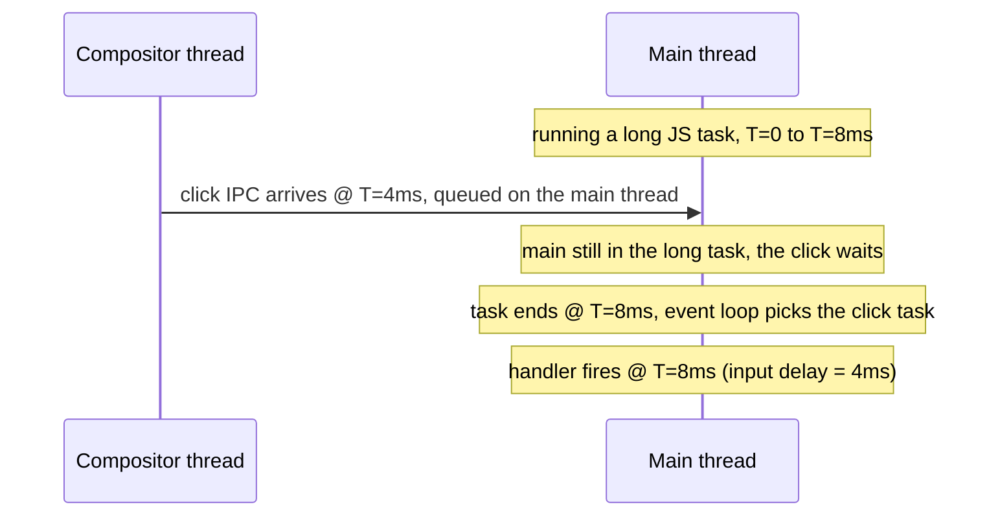

The gap between "click queued" and "click handler runs" is **input delay**, the first of the three components of Interaction to Next Paint (INP). (The other two are processing duration and presentation delay.) Input delay is exactly the cost of a busy main thread: if the thread were idle, the queued task would be picked almost immediately.

> **⏱ Timings, 3.3:**
> - **Input queue residence time:** bounded below by current-task duration plus the duration of any tasks queued ahead. On an idle main thread: **&lt;1 ms**. Mid long-task: up to the long-task duration (50 to 500+ ms). Exceeding: directly equals the Interaction to Next Paint (INP) input-delay component. _Source: [Interaction to Next Paint (INP), web.dev](https://web.dev/articles/inp)._
> - **Typical input-delay component of Interaction to Next Paint (INP) at p75 (healthy sites):** **~37 ms**. _Source: [Web Almanac 2024, Performance, 2024-11-11](https://almanac.httparchive.org/en/2024/performance)._

### 3.4 requestAnimationFrame (rAF)-aligned input coalescing

For continuous events, Chrome 60+ coalesces them and dispatches once per frame, just before `requestAnimationFrame` callbacks run, rather than dispatching one main-thread task per raw event. The Chrome blog lists the coalesced types as `wheel`, `mousewheel`, `touchmove`, `pointermove`, and `mousemove`. `event.getCoalescedEvents()` exposes the merged points so you can recover the full pointer path even though your handler fired only once for the frame (drawing apps, sensitive trackpad input). Discrete events bypass coalescing: they fire immediately on the next main-thread task pick.

A practical consequence: if you draw a line by connecting `pointermove` coordinates, the visible path can look faceted at high pointer speeds because you only get one sample per frame. Reading `getCoalescedEvents()` inside the handler gives you every intermediate sample the browser captured, so the rendered stroke stays smooth.

**Where in the event loop:** the coalesced continuous-event dispatch runs as part of the **rendering update** (step 4 of the event loop in Foundation 2), not as a separate task. Order within the rendering update: `resize` → `scroll` → coalesced input → `requestAnimationFrame` callbacks → style/layout/paint. The Chrome blog frames this as bringing continuous input "inline with scroll and resize events" in the event-loop flow. Because the input dispatch and the rAF callback happen in the same step, your `mousemove` handler and your rAF callback see the same DOM state for the same frame.

> **⏱ Timings, 3.4:**
> - **requestAnimationFrame (rAF)-aligned input coalescing window:** **~16.67 ms @ 60 Hz**, **~8.33 ms @ 120 Hz**. All continuous events arriving within this window merge into one dispatch. Effect: Chrome's Canary/Dev experiment measured ~35% fewer hit-tests; raw events remain recoverable via `getCoalescedEvents()`. _Source: [Aligned input events, developer.chrome.com](https://developer.chrome.com/blog/aligning-input-events)._

> **Sources**: [Inside Browser part 4, Mariko Kosaka](https://developer.chrome.com/blog/inside-browser-part4); [Aligned input events](https://developer.chrome.com/blog/aligning-input-events); [Compositor Thread Architecture](https://www.chromium.org/developers/design-documents/compositor-thread-architecture/); [Chromium cc/input README](https://chromium.googlesource.com/chromium/src/+/HEAD/cc/input/); [Nolan Lawson, High-perf input handling](https://nolanlawson.com/2019/08/11/high-performance-input-handling-on-the-web/).

---

## Foundation 4: `navigator.scheduling.isInputPending()`

### 4.1 What it actually queries

This is the surprise: it does **NOT** read the main-thread input queue. It reads the **compositor-thread** queue, where input lands first (per Foundation 3.1).

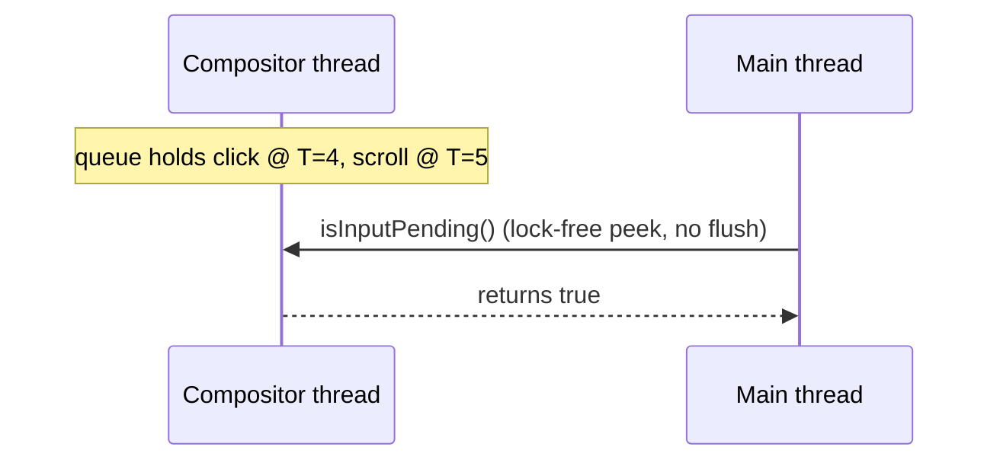

The Meta engineering blog (the team that originally proposed the Application Programming Interface (API)) states this directly: "Under the hood, isInputPending hooks into Chrome's compositor-side input queue to intercept events before they're posted to the main thread." That is why the call is cheap: no Inter-Process Communication (IPC) round-trip, just a read of shared cross-thread queue state. The same blog notes that "as all processing of these input events is done off the main thread, calls to isInputPending do not use many computational resources and should be very quick."

> **Why query the compositor queue, not the main-thread queue?** If the event were already on the main-thread queue, your existing event listener would already be queued to fire; the loop would just need to pick it. The whole value of `isInputPending()` is **early warning**: peeking one stage upstream so you can stop work *before* the event reaches main. The compositor queue lives in the same renderer process, "next door" to the main thread, so the read is a cross-thread atomic, not an IPC.

> **⏱ Timings, 4.1:**
> - **`isInputPending()` single-call cost:** **~1 to 10 µs** (no ref / estimate only: no public 2024 to 2026 microbenchmark). Mechanism: cross-thread atomic read of the compositor input-queue state.
> - **Compositor-queue-to-`true` freshness window:** **&lt;1 ms** typical (same-process posting from compositor to main). Exceeding: stale read → main runs one extra work chunk before yielding. _(no ref / estimate only)._

### 4.2 Discrete by default, continuous opt-in

Per the Web Incubator Community Group (WICG) spec, by default `isInputPending()` returns `true` only for **discrete** events. The Interface Definition Language (IDL):

```webidl
dictionary IsInputPendingOptions {
  boolean includeContinuous = false;
};
```

Per the spec, a trusted event is **continuous** if its type is one of `mousemove`, `wheel`, `touchmove`, `drag`, `pointermove`, or `pointerrawupdate`, "or a child of any of those." Everything else (click, keydown, touchstart, and so on) is discrete. Pass `{ includeContinuous: true }` to make the check also report pending continuous input.

For a background scan, discrete-only is the right default: you want to yield to a click or keystroke, not to passive mouse drift across the page, which would make you yield almost constantly while the pointer is moving.

> **⏱ Timings, 4.2:**
> - **`{includeContinuous: true}` extra cost vs default:** negligible; same queue read, wider event-type filter (no ref / estimate only).
> - Exceeding: more frequent `true` returns → over-yielding → throughput loss on continuous-event-heavy pages.

### 4.3 Cross-origin iframe false negatives

The Chrome and Mozilla Developer Network (MDN) docs flag this: setting complex clips and masks for cross-origin iframes "may report false negatives (i.e. `isInputPending()` may unexpectedly return false when targeting these frames)." Root cause: the implementation uses **compositor-side hit testing** to decide which frame an input is targeting. For cross-origin frames (rendered by a different renderer process), this hit test runs off the main thread. A complex Cascading Style Sheets (CSS) `clip-path` or `mask` defeats the fast-path hit test, and the slow path cannot answer inside the lock-free read window, so the API returns `false` rather than block the call. The conservative return is a performance-budget choice; it is not a documented cross-origin information-leak mitigation.

> **⏱ Timings, 4.3:** No timing applies; this is a semantic / correctness limitation, not a performance number.

### 4.4 Performance cost

Public sources do not publish a benchmarked number. Meta's blog asserts the call should be "very quick" but gives no microsecond figure. **Don't trust unsourced claims of "50 to 200 ns"; measure it yourself if it matters.** Mechanically it is a function call plus a lock-free queue-state read plus a boolean return. Plausibly under 1 µs, but order of magnitude is the most we can honestly claim.

Practical implication: **don't call it inside a tight loop with µs-scale work units.** Batch into chunks of meaningful work and check between chunks. The Response, Animation, Idle, Load (RAIL) model recommends keeping work quanta under 50 ms; 5 ms is a tighter budget that keeps interactions responsive (Foundation 7). Note, though, that current guidance has moved away from input-conditional polling entirely (see 4.5).

> **⏱ Timings, 4.4:**
> - **`isInputPending()` × 1000 in a tight loop:** **~1 to 10 ms** total amortized cost (no ref / estimate only, derived from 4.1). Exceeding: if work-per-iteration is under ~10 µs, the polling cost dominates.
> - **Recommended sampling cadence (if you still poll):** every **~50 ms** of work, OR between batches. Aligned with the Response, Animation, Idle, Load (RAIL) model's `<50 ms` quantum and the long-task threshold. Going beyond 50 ms between checks: you have already crossed the long-task threshold. _Source: [web.dev, Optimize long tasks (updated 2024-12-19)](https://web.dev/articles/optimize-long-tasks); [isInputPending, Chrome dev docs](https://developer.chrome.com/docs/capabilities/web-apis/isinputpending)._
> - **Real-world wins (Meta origin-trial era figure):** event latency reportedly reduced by **~100 ms at p95** during the origin trial, with throughput preserved. This figure is from the original 2019 to 2020 origin-trial reporting; no 2024 to 2026 update was located. _Source: [Meta Engineering, isInputPending](https://engineering.fb.com/2019/04/22/developer-tools/isinputpending-api/)._

### 4.5 Successor: `Scheduler.yield()`, and why isInputPending is now discouraged

Both Mozilla Developer Network (MDN) and the Chrome docs now flag `isInputPending` as superseded, and the guidance is stronger than a simple rename. MDN states:

> "The `isInputPending()` method has been superseded by features available on the Scheduler interface such as `yield()`, which are better designed for addressing scheduling tasks."

The Chrome capability doc adds an explicit note at the top: "The recommended usage of this API has changed since this document was originally published. Conditional yielding on user input is no longer recommended." web.dev's "Optimize long tasks" article goes further with a section titled **"Don't use `isInputPending()`"**, recommending that you yield **regardless of whether input is pending or not**, because conditional yielding can starve the event loop of other work (rendering, other tasks) and is subject to the false-negative cases in 4.3.

The successor is not a renamed function; it is a different Application Programming Interface (API) shape (`scheduler.yield()` returns a Promise rather than a synchronous boolean). For new code, prefer `scheduler.yield()` (or `scheduler.postTask()`) as the yield primitive, and yield on a time budget rather than gating the yield on `isInputPending()`.

> **⏱ Timings, 4.5:**
> - **`scheduler.yield()` per-call overhead:** **~10 to 100 µs** (no ref / estimate only): one Promise allocation plus queue enqueue plus new task setup plus resume.
> - **`scheduler.yield()` × 1000 in a tight loop:** **~10 to 100 ms** total. Exceeding: web.dev's explicit warning, "if some of the jobs in `jobQueue` are very short, then the overhead could quickly add up to more time spent yielding and resuming than executing the actual work." Mitigation: chunk to ≥ 5 ms (or the article's common 50 ms deadline) before yielding. _Source: [web.dev, Optimize long tasks 2024-12-19](https://web.dev/articles/optimize-long-tasks); [Web Incubator Community Group (WICG) yield-and-continuation explainer](https://github.com/WICG/scheduling-apis/blob/main/explainers/yield-and-continuation.md)._

### 4.6 Browser support, June 2026

Chromium-only. `isInputPending` shipped in Chromium-based browsers starting in version 87, so Chrome 87+ and Edge 87+. Mozilla's standards-positions issue #155 is unsigned, and there is no WebKit signal. Not in Firefox, not in Safari, no shipped intent.

> **Sources**: [Chrome dev docs, isInputPending](https://developer.chrome.com/docs/capabilities/web-apis/isinputpending); [Meta Engineering, isInputPending](https://engineering.fb.com/2019/04/22/developer-tools/isinputpending-api/); [Web Incubator Community Group (WICG) is-input-pending spec](https://wicg.github.io/is-input-pending/); [Mozilla Developer Network (MDN), Scheduling.isInputPending](https://developer.mozilla.org/en-US/docs/Web/API/Scheduling/isInputPending); [web.dev, Optimize long tasks](https://web.dev/articles/optimize-long-tasks); [Mozilla standards-positions #155](https://github.com/mozilla/standards-positions/issues/155).

---

## Foundation 5: Long Tasks & Interaction to Next Paint (INP)

### 5.1 What's a "long task"

Per World Wide Web Consortium (W3C) Long Tasks Application Programming Interface (API): a long task is **any work on the main thread that exceeds 50 ms**. The work can be:

- An event-loop task (step 1+2 of the loop) plus its trailing microtask checkpoint.
- A "rendering update" (step 4) that takes too long.
- The pause **between** two event-loop steps if the loop itself is delayed (rare).

These three cases come straight from the spec's definition: a long task is "an event loop task plus its following microtask checkpoint," an "update the rendering" step, or a pause between event-loop processing steps that involves user-agent work. In practice the first case dominates: a single JavaScript callback (an event handler, a `setTimeout` body, a framework render) runs past 50 ms and blocks everything queued behind it.

The 50 ms threshold derives from the **Response, Animation, Idle, Load (RAIL) response budget**: aim to respond to user input within 100 ms; if a 50 ms task is already in flight when input arrives, you have 50 ms left for the input task to dispatch and produce a paint. This is exactly the reasoning the spec cites: a site free of long tasks "will take less than 50 ms to finish the task that is being executed when the user input is received and less than 50 ms to execute the task to react to such user input," keeping total response under the 100 ms perceptual ceiling.

The practical takeaway is the 50 ms chunk rule: when you break work into pieces and yield between them, keep each piece at or under 50 ms. That way, an interaction landing mid-chunk waits at most 50 ms before the main thread frees up. A 200 ms unbroken task, by contrast, can stall an incoming click for the full remaining duration.

**On the RAIL "Response" budget: 100 ms.** The RAIL model (Google, 2015; still cited in 2024+ docs) sets a 100 ms budget for acknowledging user input; beyond that, users perceive lag. The 100 ms figure is the perceptual threshold, and 50 ms is the practical per-chunk processing budget once you account for background work that may already be running when input arrives. INP's 200 ms "good" threshold is RAIL's 100 ms response budget plus headroom for presentation delay (paint/commit cost the handler can't directly control). When you see 50 ms / 100 ms / 200 ms / 500 ms thresholds in this doc, they all derive from this lineage.

> **⏱ Timings, 5.1:**
> - **Long Task threshold**: **50 ms**. Exceeding: surfaced via `PerformanceObserver({type: 'longtask'})`; main thread blocked → input delay risk. _Source: [Long Tasks Application Programming Interface (API) World Wide Web Consortium (W3C) Editor's Draft 2026-03-19](https://w3c.github.io/longtasks/)._
> - **Response, Animation, Idle, Load (RAIL) response budget**: respond within **100 ms**, leaving **50 ms** for handler. _Source: [web.dev/articles/rail](https://web.dev/articles/rail) (cited in [Long Tasks spec 2026-03-19](https://w3c.github.io/longtasks/))._

### 5.2: Interaction to Next Paint (INP)

Interaction to Next Paint (INP) became a Core Web Vital on **March 12, 2024**, replacing First Input Delay (FID). It measures the latency of user interactions over the entire page lifetime, not just the first one. Where FID measured only the input delay of the very first interaction, INP observes every qualifying interaction and reports a representative worst case, which makes it a far better proxy for how responsive a page feels in practice.

What counts as an interaction:
- Click (mouse)
- Tap (touchscreen)
- Key press (physical or onscreen keyboard)

What does NOT count:
- Scroll
- Hover
- Pinch / zoom
- Pure swipe (one that doesn't resolve to a tap)

The line is roughly "discrete actions that should produce a visual response," which is why continuous gestures like scroll and hover are excluded: the browser handles those on a separate path, and folding them in would drown out the discrete interactions INP is meant to catch.

> **⏱ Timings, 5.2:**
> - **Date Interaction to Next Paint (INP) became a Core Web Vital**: **2024-03-12**. _Source: [Interaction to Next Paint (INP) becomes a Core Web Vital, web.dev 2024-03-12](https://web.dev/blog/inp-cwv-march-12)._
> - **First Input Delay (FID) deprecation**: removed from Google Search Console on **2024-03-12**; six-month deprecation period in other tools (PageSpeed Insights, CrUX). _Source: same._
> - **Chrome User Experience Report (CrUX) 2024 Interaction to Next Paint (INP) Core Web Vitals (CWV) pass-rate**: Mobile **74%** good; Desktop **97%**; mobile-desktop gap **23 pp**. _Source: [Web Almanac 2024, Performance, 2024-11-11](https://almanac.httparchive.org/en/2024/performance)._

### 5.3 Interaction to Next Paint (INP) composition

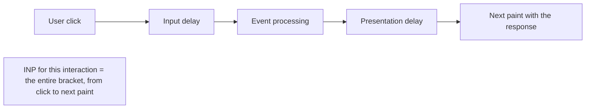

Three components:

- **Input delay**: from interaction start until the first event handler begins. Driven by main-thread availability. Long tasks make this big.
- **Processing duration**: handler code executing. Driven by your handler's complexity. This covers every event handler callback that runs for the interaction, not just one.
- **Presentation delay**: from handler end to the next paint that visually reflects the change. Driven by layout/paint cost.

These three map directly onto the spec's model: input delay is the time before event handlers begin, processing duration is the time for all handler callbacks to run, and presentation delay is the time after callbacks complete until the frame renders. The sum, from interaction start to the paint that reflects it, is the latency for that single interaction.

> **What's a "paint"?** A paint is the browser pixel commit that follows style, layout, then composite: the moment your Document Object Model (DOM) mutation actually appears on screen. INP's "next paint" is the *first* paint after the handler ends that includes the visual change driven by the interaction (for example, a menu opens, a checkbox toggles, a spinner appears). A paint that contains no response-related update doesn't end the INP measurement.

> **⏱ Timings, 5.3 (per-component contribution, Web Almanac 2024 medians):**
> - **Input delay**: on the order of tens of milliseconds at the median on healthy sites; climbs sharply at higher percentiles, where it becomes the dominant component. Exceeding: pushes total Interaction to Next Paint (INP) past the 200 ms "good" cutoff. _Source: [Web Almanac 2024, Performance](https://almanac.httparchive.org/en/2024/performance)._
> - **Processing duration**: handler logic; the primary fix target for `scheduler.yield()`. Exceeding: handler work dominates Interaction to Next Paint (INP). _Source: same._
> - **Presentation delay**: **~36 ms** at the median, the largest median contributor per the Almanac. Exceeding: rendering/commit cost; fix via Document Object Model (DOM)-update minimisation, `content-visibility: auto`. _Source: same._
> - **Shape of the breakdown**: at the median, presentation delay leads; at high percentiles (the tail that INP's p75 reporting actually punishes), input delay takes over. Healthy sites keep the combined total well under the 200 ms "good" cutoff, leaving headroom. _Source: same._

### 5.4 Scoring (real Core Web Vital methodology)

| Threshold | Verdict |
|---|---|
| < 200 ms | Good |
| 200-500 ms | Needs improvement |
| > 500 ms | Poor |

Per-page Interaction to Next Paint (INP) value is hybrid:
- Pages with **< 50 interactions** → Interaction to Next Paint (INP) = single worst interaction.
- Pages with **≥ 50 interactions** → Interaction to Next Paint (INP) ignores one highest interaction for every 50 interactions (effectively approaching a high in-page percentile) to reject outliers.

The reported field metric (used for Core Web Vitals (CWV) passing) is the **p75 of those per-page values across all visits to the URL**, segmented by device type (mobile and desktop reported separately).

**Why a hybrid?** A user spamming the same flaky button 200 times shouldn't fail a URL on a single 2-second outlier, but neither should one rage-click be hidden by 199 fast ones. The **per-page** stage absorbs noise within one visit; the **across-visits p75** stage means 75% of real user sessions need to clear 200 ms for the URL to pass. Stage 1 picks the representative bad interaction *for this session*; stage 2 asks whether bad sessions are the exception or the rule.

> **⏱ Timings, 5.4 (Core Web Vitals (CWV) thresholds at p75):**
> - **"Good"**: **≤ 200 ms**. _Source: [Interaction to Next Paint (INP), web.dev (updated 2025-09-02)](https://web.dev/articles/inp)._
> - **"Needs improvement"**: **> 200 ms and ≤ 500 ms**. _Source: same._
> - **"Poor"**: **> 500 ms**. Exceeding 500 ms: page fails Core Web Vitals (CWV) → ranking-signal impact. _Source: same._

### 5.5 Long Animation Frames (LoAF): the modern attribution surface

Long Animation Frames Application Programming Interface (API) shipped in Chrome 123 (March 2024).

**Why LoAF exists:** Long Tasks fires per *single task* over 50 ms. But INP-relevant jank often comes from many sub-50 ms tasks stacking between two renders, each individually invisible to Long Tasks. LoAF reframes the unit from "task" to "animation frame" (the work between two consecutive renders) and surfaces a frame when a rendering update is delayed beyond 50 ms of total work. That makes LoAF's window match INP's window: input, then all intervening work, then paint.

Concretely, picture five separate 15 ms tasks running back to back before the next render. No single one trips the Long Tasks 50 ms threshold, so Long Tasks stays silent, yet together they delay the frame by 75 ms and wreck the interaction. LoAF reports that frame; Long Tasks never sees it.

Where Long Tasks gives you "a task on the main thread took over 50 ms" attributed only to the *frame container* (which iframe or same-origin descendant, via `containerType`/`containerSrc`/`containerId`/`containerName`), Long Animation Frames (LoAF) gives you per-script attribution within the offending frame:

- `sourceURL`, `sourceFunctionName`, `sourceCharPosition`
- `invoker`, what triggered the script (event listener, `setTimeout`, requestAnimationFrame (rAF), etc.)
- `blockingDuration`, `renderStart`, `styleAndLayoutStart`, `forcedStyleAndLayoutDuration`
- `firstUIEventTimestamp`

Only scripts that run for more than 5 ms within the long animation frame get this per-script attribution, which filters out negligible contributors and keeps the report focused on the scripts that actually moved the needle.

For Interaction to Next Paint (INP) debugging in 2026, prefer Long Animation Frames (LoAF) where available; fall back to Long Tasks for cross-browser support, since LoAF remains a Chromium feature.

> **⏱ Timings, 5.5:**
> - **Long Animation Frames (LoAF) frame threshold**: **50 ms**. Exceeding: frame surfaced via Long Animation Frames (LoAF) Application Programming Interface (API); `blockingDuration` sums the blocking portions of tasks over 50 ms within the frame. _Source: [Long Animation Frames (LoAF) docs, developer.chrome.com 2024-10-14](https://developer.chrome.com/docs/web-platform/long-animation-frames)._
> - **Long Animation Frames (LoAF) script-attribution threshold**: scripts running **more than 5 ms** within a long animation frame get per-script attribution. _Source: same._
> - **Long Animation Frames (LoAF) Application Programming Interface (API) ship date**: **Chrome 123 stable, 2024-03-19** (desktop release; after origin trial Chrome 116 to 122). _Source: [Chrome Releases, Stable Channel Update for Desktop, 2024-03-19](https://chromereleases.googleblog.com/2024/03/stable-channel-update-for-desktop_19.html); [Long Animation Frames (LoAF) has shipped, developer.chrome.com](https://developer.chrome.com/blog/loaf-has-shipped)._
> - **Real-world Interaction to Next Paint (INP) wins from main-thread yielding (2024 case studies):**
>   - **Trendyol**: p75 Interaction to Next Paint (INP) **~1,400 ms → ~650 ms** (~50% reduction) over six months after adopting `scheduler.yield()`; correlated with a 1% click-through-rate uplift. _Source: [web.dev/case-studies/trendyol-inp](https://web.dev/case-studies/trendyol-inp)._
>   - **Taboola**: using `scheduler.postTask()` via their Performance Fader: publisher A **75 → 48 ms** (36%); publisher C **135 → 92 ms** (33%); publisher D **52 → 37 ms** (29%); RELEASE.js Total Blocking Time (TBT) **712 → 206 ms** (a 485 ms, 70% reduction). _Source: [web.dev/case-studies/taboola-inp 2024-02-01](https://web.dev/case-studies/taboola-inp)._
>   - Range across reported cases: roughly **6% to 50%** p75 Interaction to Next Paint (INP) reduction.

> **Sources**: [Interaction to Next Paint (INP), web.dev](https://web.dev/articles/inp); [Interaction to Next Paint (INP) becomes a Core Web Vital on March 12](https://web.dev/blog/inp-cwv-march-12); [Long Tasks Application Programming Interface (API) spec](https://w3c.github.io/longtasks/); [Long Animation Frames Application Programming Interface (API)](https://developer.chrome.com/docs/web-platform/long-animation-frames); [The Response, Animation, Idle, Load (RAIL) performance model](https://web.dev/articles/rail).

---

## Foundation 6: `scheduler.yield()` Mechanics

### 6.1 What `await scheduler.yield()` does

Splits the current async function's body into two tasks. The pre-`await` half is the current task; the post-`await` continuation is queued as a *new task* on the scheduler's continuation queue. The key payoff: between those two tasks the event loop gets a full turn, so the browser can paint, dispatch input, and run higher-priority work before your function resumes.

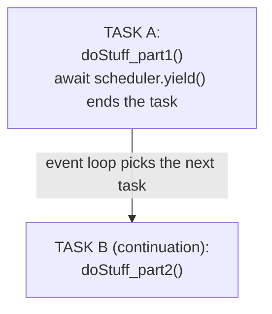

Crucially, the continuation is not a plain task: it is enqueued in a *boosted* queue relative to a `scheduler.postTask()` of the same priority. The Chrome docs put it directly: "`scheduler.yield()` enqueues its task in a boosted task queue compared to a `scheduler.postTask()` of the same priority level." That boost is what makes yielding safe for responsiveness without losing your place in line, and it is the property we exploit throughout this section. _Source: [Chrome dev blog: Use scheduler.yield](https://developer.chrome.com/blog/use-scheduler-yield)._

> **⏱ Timings, 6.1:**
> - **`await scheduler.yield()` continuation latency**: **~0.1 to 5 ms** typical (longer if higher-priority tasks ahead) (no ref / estimate only). Exceeding: jank, missed 16.67 ms frame budget, Interaction to Next Paint (INP) regression past 200 ms target. _Source: [Mozilla Developer Network (MDN) Scheduler.yield (2025-09-25)](https://developer.mozilla.org/en-US/docs/Web/API/Scheduler/yield)._
> - **`scheduler.yield()` overhead per call**: **~10 to 100 µs** (no ref / estimate only): Promise alloc + boosted-queue enqueue + new task pickup. Exceeding: dominates wall-time if work-per-iteration is under ~100 µs (web.dev explicit warning). _Source: [web.dev, Optimize long tasks 2024-12-19](https://web.dev/articles/optimize-long-tasks)._

### 6.2 Continuation queue + effective priority

Per Web Incubator Community Group (WICG) spec, the scheduler maintains queues keyed by `(priority, isContinuation)`. Three priorities times `{fresh, continuation}` gives 6 logical queues:

| Priority | Continuation? | Effective priority |
|---|---|---|
| `'background'` | false | 0 (lowest) |
| `'background'` | true | 1 |
| `'user-visible'` | false | 2 |
| `'user-visible'` | true | 3 |
| `'user-blocking'` | false | 4 |
| `'user-blocking'` | true | 5 (highest) |

Selection algorithm (§2.4.3 of Web Incubator Community Group (WICG) spec): pick the queue with highest effective priority that has runnable tasks; from that queue, pick the oldest (FIFO).

A continuation slots **between** its base priority and the next higher one. The WICG explainer states it plainly: the scheduler keeps "a continuation task queue for each scheduler priority," and a continuation's effective priority "is between priority and the next highest scheduler priority." So a `'user-visible'` continuation outranks fresh `'user-visible'` work but still sits below fresh `'user-blocking'` work. The "+1" framing is shorthand for that ordering; there is no numeric arithmetic in the spec, just six ordered buckets. _Source: [yield-and-continuation explainer](https://github.com/WICG/scheduling-apis/blob/main/explainers/yield-and-continuation.md)._

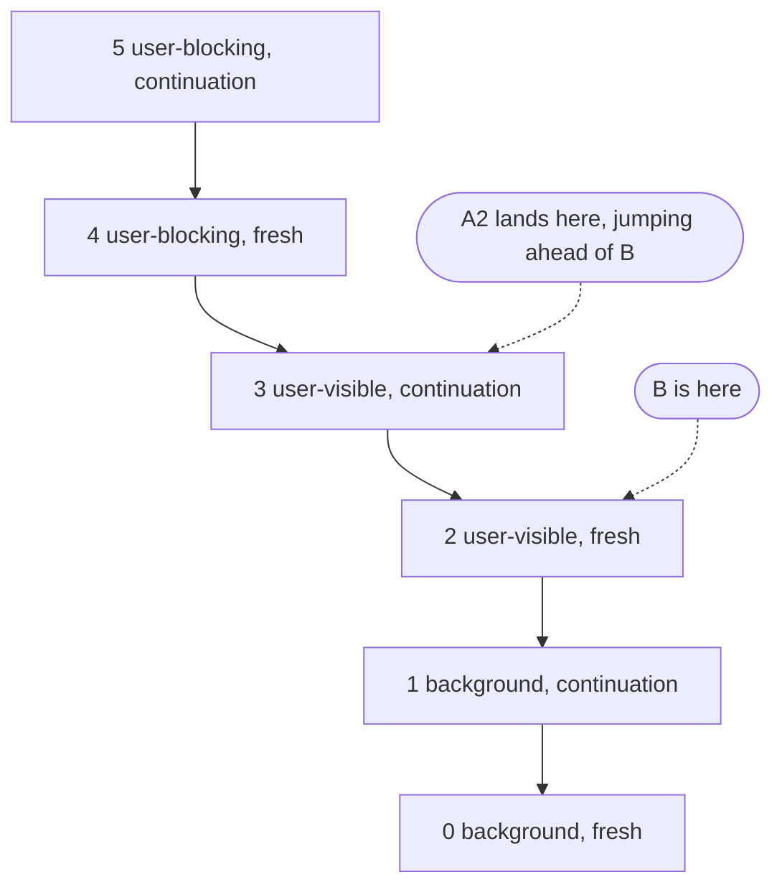

The purpose of the boost is explicit in the spec rationale: prioritizing continuations over same-priority fresh tasks reduces the overhead of yielding, so that breaking a task into many small pieces does not repeatedly send each piece to the back of the line.

> **⏱ Timings, 6.2:**
> - **Effective-priority queue selection**: **O(1) per dispatch** (UA picks oldest task at highest effective priority); absolute ns: no ref / estimate only.
> - **Continuation queue drain**: **O(N) FIFO**, **~10 to 100 µs per dequeue** (no ref / estimate only). Exceeding: starvation of lower-priority `postTask` while continuations drain. _Source: [Web Incubator Community Group (WICG) yield-and-continuation explainer](https://github.com/WICG/scheduling-apis/blob/main/explainers/yield-and-continuation.md)._

### 6.3 Worked example

```js
scheduler.postTask(async () => {
  console.log('A1');
  await scheduler.yield();
  console.log('A2');
}, { priority: 'user-visible' });

scheduler.postTask(() => console.log('B'), { priority: 'user-visible' });
```

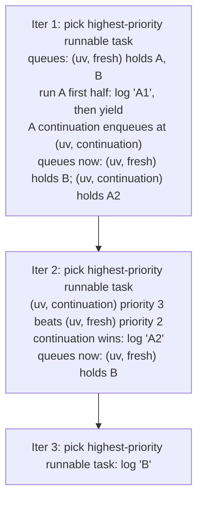

Output: **A1, A2, B**, not A1, B, A2. This is the boosted-queue behavior from 6.1 made concrete: even though `B` was already sitting in the fresh `'user-visible'` queue when `A` yielded, `A`'s continuation lands one rung higher and runs first.

Compare with `await new Promise(r => setTimeout(r, 0))` instead of `scheduler.yield()`:

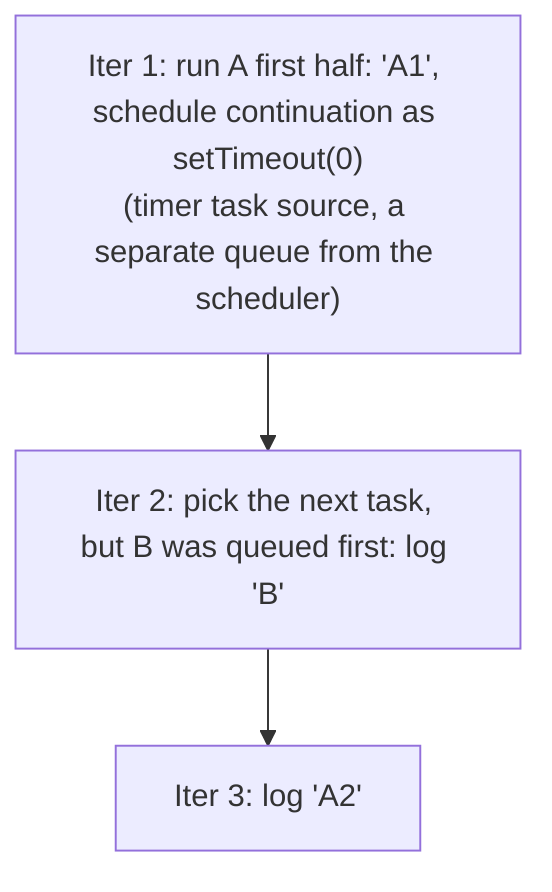

Output: **A1, B, A2**. The continuation lost its place.

**Why setTimeout(0) loses:** timer callbacks run from the **timer task source**, which the event loop treats as a peer-priority generic task. It has no notion of `'user-visible'` versus `'background'` and no continuation boost. So A's "continuation" is just another generic task at the back of the run queue, picked after B (which was queued earlier). On top of that, repeated nested `setTimeout(0)` hits the HTML-spec 4 ms clamp after 5 levels of nesting, which makes it strictly worse than `scheduler.yield()` for chunked work.

> **⏱ Timings, 6.3:** No timing applies; illustrative ordering only.

### 6.4 What happens between yield and continuation

Between the two tasks, the event loop completes a full iteration:

- ✅ Microtask checkpoint runs (after A's first half).
- ✅ Possibly a rendering opportunity, so paint can happen.
- ✅ Other queued tasks of higher effective priority run.
- ✅ Input dispatch happens if input was queued and its priority outranks the continuation.

**About that priority outrank:** user-input dispatch (clicks, keys, pointer events) runs at effective priority 4 (`'user-blocking'` fresh), so it outranks every `'user-visible'` and `'background'` continuation. A yield from a `'user-visible'` `postTask` therefore reliably lets queued input through before resuming, even when the continuation carries the +1 boost. That is exactly the responsiveness win the Chrome docs advertise: show a spinner, `await scheduler.yield()`, and the click handler's queued input and paint get serviced before your heavy work resumes.

The yield is therefore a real "let the browser breathe" point, not a fake microtask trick. A microtask (a bare `await Promise.resolve()`) stays inside the *same* task and runs before the next rendering opportunity, so it never yields the thread; `scheduler.yield()` genuinely ends the task and hands the event loop a clean turn.

> **⏱ Timings, 6.4 (gap between yield and continuation):**
> - **Microtask checkpoint**: **&lt;1 µs to ~ms** depending on queue length (per 2.1).
> - **Rendering opportunity**: **0 ms** (skipped) up to **~16 ms** if a paint runs (browser-decided).
> - **Higher-priority tasks running ahead of continuation**: unbounded; user-blocking input or requestAnimationFrame (rAF) callbacks slot in here.
> - **Total: typical gap**: **~ms-scale** on a healthy idle main thread; **tens of ms** when input or rendering needs the slot.

### 6.5 Priority inheritance

`scheduler.yield()` inherits from the surrounding `postTask`'s priority. Outside any `postTask`, it defaults to `'user-visible'`. It also inherits the surrounding `postTask`'s `TaskSignal`, which means aborting the parent signal also cancels the pending continuation (and the resumed `await` throws an `AbortError` inside the awaiting function). The spec notes this inheritance is propagated through the async function even when the scheduler context is lost by hopping through another task source, for example a `fetch()` completion, so the continuation keeps the right priority and signal across those boundaries. Surprising case: **inside `requestIdleCallback`**, there is no signal to inherit, so the inherited priority is `'background'` AND the continuation is non-abortable. _Source: [yield-and-continuation explainer](https://github.com/WICG/scheduling-apis/blob/main/explainers/yield-and-continuation.md)._

> **⏱ Timings, 6.5:** No timing applies; semantic / behavioural fact.

### 6.6 Polyfill caveat

`scheduler-polyfill` v1.3.0 (2024-10-22, latest as of June 2026):

```js
// From the polyfill source
yield() {
  // Inheritance is not supported. Use default options instead.
  return this.postTaskOrContinuation_(() => {}, { priority: 'user-visible' }, true);
}
```

The polyfill **does not support priority or signal inheritance**: it ignores the surrounding `postTask` priority and never wires up an abort signal, so a polyfilled continuation cannot be cancelled by aborting the parent. Per the README, "all continuations are scheduled with `'user-visible'` continuation priority." That refers to the conceptual priority tier, not the underlying scheduling mechanism. The mechanism is more nuanced: "for browsers that support `scheduler.postTask()`, `scheduler.yield()` is polyfilled with `'user-blocking'` `scheduler.postTask()` tasks," so the continuation still typically lands at a higher event-loop priority than other tasks (consistent with native `yield()`), but it can be interleaved with other genuine `'user-blocking'` tasks. On browsers that lack `postTask()` entirely, the polyfill falls back to its own event-loop scheme where continuations run between `'user-blocking'` and `'user-visible'` work. The practical takeaway: with the polyfill you lose inheritance and exact ordering guarantees, but you keep the rough "continuations beat ordinary work" behavior. _Source: [scheduler-polyfill README, v1.3.0](https://github.com/GoogleChromeLabs/scheduler-polyfill)._

The polyfill's native-detection is per-method, not per-API: on Chrome 94 to 128 (where `postTask` was native but `yield` was not), the polyfill leaves native `postTask` in place and patches only `Scheduler.prototype.yield`. From Chrome 129 / Firefox 142 onward, both are native and the polyfill is a no-op.

> **⏱ Timings, 6.6:**
> - **Polyfill yield extra cost vs native**: **~100 µs to 4 ms per yield** (no ref / estimate only): MessageChannel path ~µs, `setTimeout` fallback hits the 4 ms clamp after nesting. Exceeding: under nested yields the polyfill collapses to **4 ms per yield**, 10 to 20 times slower than native. _Source: [scheduler-polyfill v1.3.0 README, 2024-10-22](https://github.com/GoogleChromeLabs/scheduler-polyfill)._
> - **Polyfill `yield()` priority behaviour**: no priority/signal inheritance; the continuation tier is `'user-visible'`, implemented via `'user-blocking'` `postTask` where native `postTask` exists. Confirmed v1.3.0+ (2024 to 2026). _Source: same._

### 6.7 Browser support (June 2026, validated)

| Browser | Version | Notes |
|---|---|---|
| Chrome | 129+ (Sep 2024) | Native, full inheritance |
| Edge | 129+ | Chromium parity |
| Firefox | **142+** (enabled by default; pref `dom.enable_web_task_scheduling`) | Native |
| Safari | not shipped | No public intent |

Global support sits at roughly 72% as of mid-2026, gated almost entirely by Safari's absence. _Source: [caniuse Scheduler.yield](https://caniuse.com/mdn-api_scheduler_yield)._

> **⏱ Timings, 6.7 (ship dates):**
> - **Chrome 129 stable**: **2024-09-17** (`scheduler.yield()` shipped natively in this release; `scheduler.postTask()` had been native since Chrome 94). _Source: [Chrome Releases blog 2024-09-17](https://chromereleases.googleblog.com/2024/09/stable-channel-update-for-desktop_17.html)._
> - **Firefox 142 stable**: **2025-08-19**. Firefox 142 shipped the Prioritized Task Scheduling API (including `Scheduler`, `TaskController`, `TaskSignal`) enabled by default. _Source: [Firefox 142 release notes](https://developer.mozilla.org/en-US/docs/Mozilla/Firefox/Releases/142)._

> **Sources**: [Web Incubator Community Group (WICG) Scheduling APIs spec](https://wicg.github.io/scheduling-apis/); [yield-and-continuation explainer](https://github.com/WICG/scheduling-apis/blob/main/explainers/yield-and-continuation.md); [Mozilla Developer Network (MDN), Scheduler.yield](https://developer.mozilla.org/en-US/docs/Web/API/Scheduler/yield); [Chrome dev blog: Use scheduler.yield](https://developer.chrome.com/blog/use-scheduler-yield); [scheduler-polyfill v1.3.0 source](https://github.com/GoogleChromeLabs/scheduler-polyfill); [caniuse Scheduler.yield](https://caniuse.com/mdn-api_scheduler_yield).

---

## Foundation 7: Putting It Together: The Anti-Pattern

Now we can finally explain why that anti-pattern is broken.

### 7.1 The anti-pattern code

```js
// WRONG — yield only when isInputPending() returns true.
while (workQueue.length) {
  process(workQueue.shift());
  if (navigator.scheduling.isInputPending()) {
    await scheduler.yield();
  }
}
```

### 7.2: What goes wrong, timeline

Suppose `process(item)` of one work item takes 8 ms (a moderate chunk). The user clicks at T=4 ms (mid-chunk).

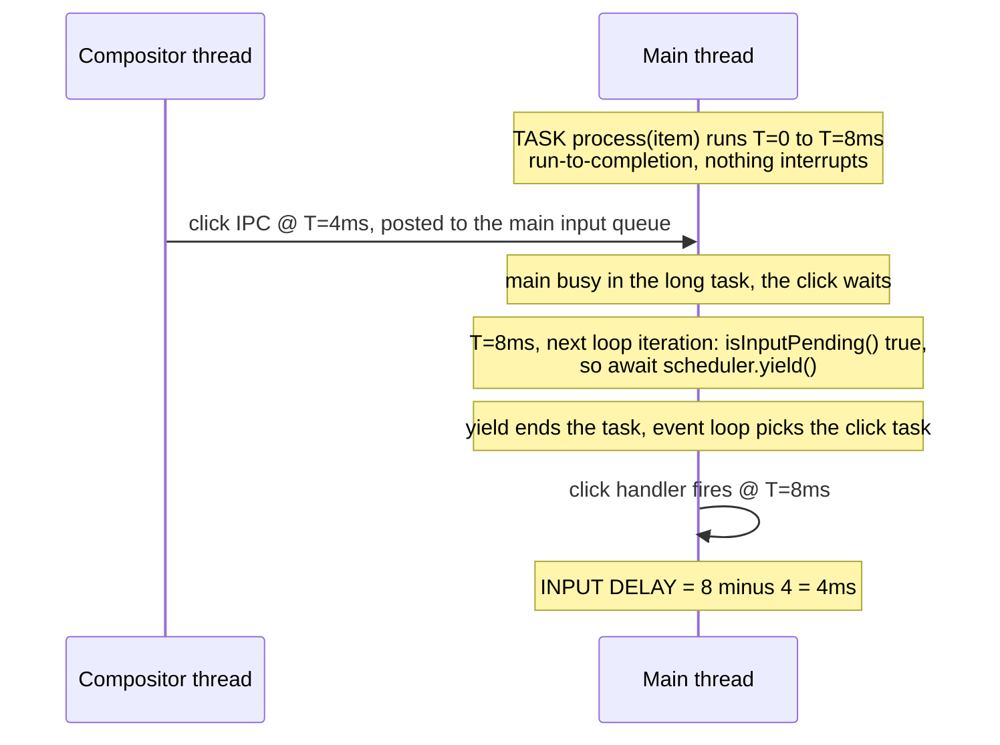

Three things going wrong:

1. **Peek runs only between iterations of your loop, not during them.** Once `process(item)` starts, the iron rule from Foundation 2 takes over. You don't get to peek until `process` returns. The `if` check sits at the top of the loop body, so it can only fire after a full work item completes; the browser cannot inject your check into the middle of a synchronous call.
2. **The peek happens too late.** By the time `isInputPending()` fires at T=8 ms, 4 ms of input delay are already baked in. The input arrived at T=4 ms and was already sitting in the queue; the peek does not retroactively recover the time already lost while the task ran.
3. **No upper bound on chunk duration.** If `process(item)` takes 50 ms, input delay is 50 ms. The pattern degrades silently with item complexity: nothing in the code caps how long a single iteration can run, so the worst-case latency tracks whatever the slowest work item happens to cost.

The deeper problem: **on a fully idle page (user reading, no clicks), the loop never yields.** `isInputPending` returns false forever. The whole thing becomes one giant long task. This is the chained-timer trap from a different angle: the pattern *appears* responsive in benchmarks where input is constant, then catastrophically fails in the common case where it is sparse. Worse, "no input" is the normal state for most of a page's lifetime, so the failure mode is the default, not the edge case.

> **Recap of Iron Rule #2 (Foundation 2.1):** once a task starts, the event loop will not preempt it for input, rendering, or anything else; the task runs synchronously to its return point, then the next loop iteration picks. This matches the platform's run-to-completion model: each task runs until it finishes, regardless of how long it blocks the main thread. _Source: [MDN, Event loop, run-to-completion](https://developer.mozilla.org/docs/Web/JavaScript/EventLoop#run-to-completion)._ This is why `isInputPending()` *inside* the work body would also be useless: even if it returned true, you would have nowhere to deliver the input until your task ended. The only escape is for *your* task to end (return, or `await` a real task boundary) so a *new* task, input dispatch, can be picked.

> **Note on current Chrome team guidance (web.dev, last updated 2024-12-19):** the "Optimize long tasks" article now recommends *against* `isInputPending()` as a primary signal. It states plainly that "we no longer recommend using this API, and instead recommend yielding regardless of whether input is pending or not." Two reasons are cited: `isInputPending()` "may incorrectly return `false` despite a user having interacted in some circumstances," and "input isn't the only case where tasks should yield. Animations and other regular user interface updates can be equally important." _Source: [web.dev, Optimize long tasks](https://web.dev/articles/optimize-long-tasks)._ The specific false-negative case is documented separately: setting complex clips and masks for cross-origin iframes may report false negatives, so the API can return `false` even when input is genuinely pending. _Source: [web.dev, Better JS scheduling with isInputPending()](https://web.dev/isinputpending/)._ The pattern in §7.3 still uses `isInputPending()` as an *optional accelerator* for the time budget, not as the primary signal. If you drop it entirely and rely on the 5 ms time budget alone, you lose at most 5 ms of input latency in exchange for simpler code; for many extensions that is the better tradeoff. **Keep the time budget; treat `isInputPending` as cosmetic.**

> **⏱ Timings, 7.2 (anti-pattern, illustrative scenario):**
> - **Per-chunk duration:** **8 ms** (illustrative; can be much higher in practice as chunk size does not adapt).
> - **Input delay accumulated:** **≈ chunk length** at worst case (4 ms in the diagram, up to 50 to 100+ ms on real workloads).
> - **Idle-page worst case:** **unbounded.** The loop becomes one giant long task with NO yields, exceeding the 50 ms long-task threshold trivially and hammering Interaction to Next Paint (INP).

### 7.3: The correct pattern, code

```js
let chunkStart = performance.now();
while (workQueue.length) {
  process(workQueue.shift());

  const elapsed = performance.now() - chunkStart;
  const inputPending = navigator.scheduling?.isInputPending?.() ?? false;

  if (inputPending || elapsed > 5) {
    await scheduler.yield();
    chunkStart = performance.now();
  }
}
```

Two yield triggers OR'd together:

- **Time budget (5 ms):** yields unconditionally every 5 ms. Bounds chunk length even on idle pages. This is the floor that the anti-pattern lacks entirely.
- **Input-pending peek:** yields *immediately* if input is queued, even before 5 ms. The optional chaining (`?.`) and `?? false` mean the code degrades gracefully to time-budget-only behavior in browsers that do not expose `isInputPending`, which is consistent with treating it as a cosmetic accelerator.

Note that `scheduler.yield()` is the right primitive for the resume here rather than a plain `setTimeout`: its continuation is sent to the *front* of the queue, so the rest of your loop resumes ahead of newly arrived same-priority tasks instead of going to the back of the line. _Source: [Chrome for Developers, Introducing the scheduler.yield origin trial](https://developer.chrome.com/blog/introducing-scheduler-yield-origin-trial)._

### 7.4: Correct pattern, timeline

Same scenario: click at T=4 ms. But `process(item)` is now small enough (~1 ms each) to fit in the budget; that is part of the contract.

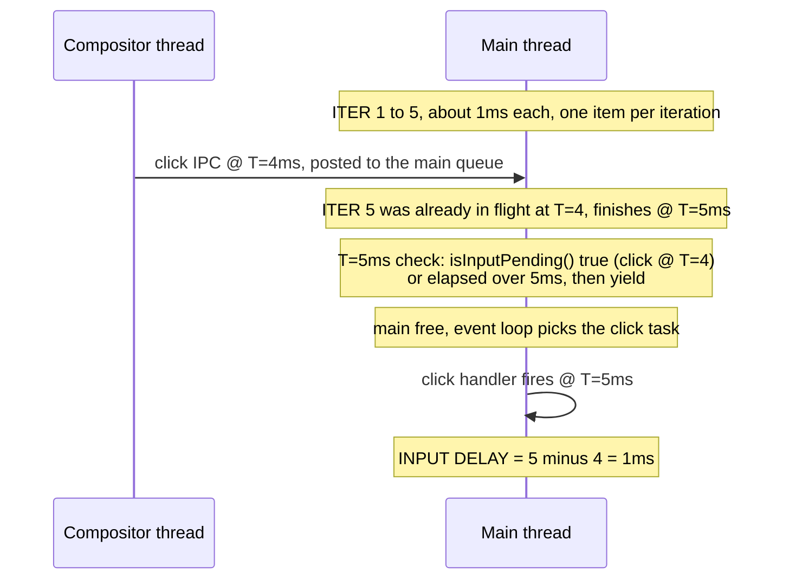

Click latency dropped from 4 ms to 1 ms. And on an idle page with no clicks, the time-budget branch fires every 5 ms, chunks stay bounded, and Interaction to Next Paint (INP) stays clean. The key shift is that responsiveness no longer depends on whether input happens to be pending; the time budget guarantees a yield boundary on a fixed cadence no matter what the user is doing.

> **⏱ Timings, 7.4 (correct pattern):**
> - **Time budget per chunk:** **5 ms** (chosen target). Chunks bounded regardless of input. Exceeding: > 50 ms = long task, Interaction to Next Paint (INP) regression. _Source: [web.dev, Optimize long tasks (last updated 2024-12-19)](https://web.dev/articles/optimize-long-tasks); Response, Animation, Idle, Load (RAIL) 50 ms budget._
> - **Click latency in scenario:** **~1 ms** (peek catches input within the 5 ms chunk).
> - **Yield overhead per chunk:** **~10 to 100 µs** (per 6.1), a small fraction of the 5 ms work budget.
> - **Total, end-to-end click latency on busy page:** **5 ms** time-budget ceiling vs **chunk-length** in the anti-pattern. **5 to 20x improvement** depending on chunk size.

### 7.5: Why time budget AND input-pending (not either alone)

| Pattern | Idle page (no input) | Heavy typing |
|---|---|---|
| Time budget only | ✅ 5 ms chunks, Interaction to Next Paint (INP) clean | ⚠ Up to 5 ms input delay |
| `isInputPending` only | ❌ Never yields → giant long task | ✅ Yields on every input |
| **Both OR'd** | ✅ 5 ms chunks | ✅ Yields immediately on input |

Both. Always. The time budget is the floor on responsiveness; `isInputPending` lets you go *under* the floor when there is actual input. Drop the time budget and the idle page degrades into one unbounded long task (the anti-pattern); drop the peek and you give up at most 5 ms of best-case input latency. Since the time budget alone already keeps you out of long-task territory, the peek is the part you can safely omit, which is exactly why current web.dev guidance treats it as optional.

> **⏱ Timings, 7.5 (per pattern variant):**
> - **Time-budget only, idle page:** chunks bounded at **5 ms**.
> - **Time-budget only, busy page:** input delay up to **5 ms** (acceptable).
> - **`isInputPending`-only, idle page:** **unbounded** long task. Interaction to Next Paint (INP) catastrophic.
> - **`isInputPending`-only, busy page:** input delay near **0 ms** (good).
> - **Both OR'd, idle page:** chunks bounded at 5 ms.
> - **Both OR'd, busy page:** input delay bounded at min(5 ms, isInputPending check rate).

### 7.6 Visual summary

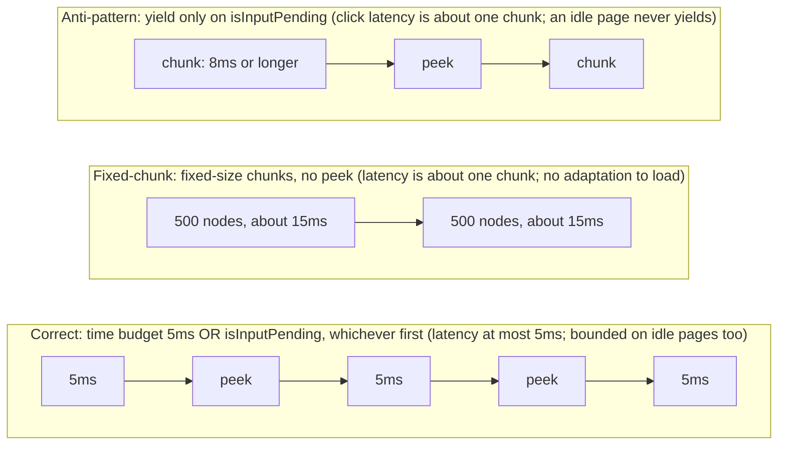

---

## How `requestIdleCallback` Actually Works

### The spec algorithm

Per the W3C `requestIdleCallback` spec:

1. **Queue the callback.** `requestIdleCallback(fn, { timeout })` appends `fn` to the document's *list of idle request callbacks* with a fresh handle and returns that handle immediately. If `timeout > 0`, the UA also waits `timeout` ms and then queues a task on the idle-task source that invokes the callback by force.
2. **Idle period start.** Defined as "user agent determined." The spec gives the UA total freedom: it *may* delay the period for power, *may* skip it entirely, *may* end it early. When a period starts, the UA moves the pending entries from the *list of idle request callbacks* to a *list of runnable idle callbacks* in order, then queues a task to run them.
3. **Compute deadline.** When the UA decides to start an idle period, it picks an end time. The spec caps that deadline at 50 ms from the start of the period; in the spec's own words, "Capping idle deadlines to 50ms means that even if user input occurs immediately after the idle task has begun, the user agent still has a remaining 50ms in which to respond to the user input without producing user perceptible lag." Chromium's implementation uses `min(next_vsync, 50 ms)`: the deadline is whichever comes first, the next predicted frame boundary or 50 ms from now. For a 60 Hz display with a frame currently in progress, this is typically 5 to 15 ms; on a fully idle page Chrome will hand out the full 50 ms. `IdleDeadline.timeRemaining()` returns `deadline - now`, clamped to zero.
4. **Invoke callbacks.** For each callback queued *before this idle period started*, call `fn(deadline)` with `deadline.timeRemaining()` returning `max(0, end - now)` and `deadline.didTimeout = false`. The spec is explicit: callbacks queued *during* the current idle period are deferred to the next one. As the spec puts it, "if an idle callback posts another callback using `requestIdleCallback()`, this subsequent callback won't be run during the current idle period." This is what enables the "self-reschedule" pattern observer.js uses.
5. **Forced timeout fire.** If the parallel timeout task fires before any idle period, invoke the callback with `deadline.timeRemaining() === 0` and `deadline.didTimeout = true`. Idle and timeout fires race: whichever happens first cancels the other.

> **The spec language is deliberately weak.** Phrases like "user agent may," "implementation defined," and "should be initially empty" appear throughout. Two browsers can both be spec-compliant while behaving very differently. Chrome's heuristic (frame-budget plus 50 ms cap) is documentation, not specification.

### Where rIC sits in the event loop (Chromium)

Per `third_party/blink/renderer/core/scheduler/idle_deadline.cc` and the rendering pipeline:

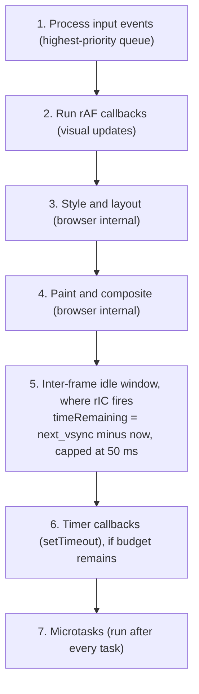

Two consequences:

- **rIC fires *after* paint, not before.** A DOM write inside an rIC callback dirties layout for frame N+1, not frame N. The user sees the unstamped DOM for one extra frame compared to a sync write or a `MessageChannel.postMessage(null)` task.
- **`timeRemaining` is a *prediction*, not a contract.** Chromium computes it from a moving average of recent frame durations. Heavy GC, layout invalidations, or late-arriving input can blow through the predicted budget. The function will keep returning positive numbers right up until it returns 0.

### Browser support 2026

| Browser | rIC support | Throttling specifics |
|---|---|---|
| Chrome 47+ | Yes | Budget plus intensive throttling as below |
| Edge 79+ | Yes (Chromium) | Same as Chrome |
| Firefox 55+ | Yes | Less aggressive throttling (no formal "intensive" tier) |
| Safari | **No** (none planned) | n/a |

If you don't target Safari, the Safari gap is irrelevant; the practical concern is throttling in Chrome, where most users are.

---

## Why rIC is suboptimal

### Background-tab throttling

Chrome aggressively throttles rIC in non-foreground tabs. Two mechanisms stack:

- **Budget-based throttling (since Chrome 57).** Once a tab has been backgrounded for at least 10 s, scripts run only while a per-tab time budget is available; the budget tops up at a steady rate (historically about 0.01 s per second) with a ceiling, so runaway scripts can't hog the CPU.
- **Intensive throttling (after 5 min hidden).** A tab inactive for over 5 minutes has its timers (including rIC fallback paths) capped at **1 fire per minute**.
- **Exemptions.** Audio playback, active WebSocket, and WebRTC connections exempt a tab from throttling (rarely relevant for a content script).

Separately, the rIC spec itself permits the UA to throttle idle-period generation when the document is hidden, "for example limiting the Document to one idle period every 10 seconds," so even idle periods (not just timer fallbacks) slow down in the background.

### Post-paint timing plus DOM mutations

rIC fires *after* layout and paint. Per spec and MDN, doing DOM writes inside an rIC callback forces a reflow on the next frame. Yielding via `postTask`/`yield` lands the same writes earlier in the next frame's lifecycle (before paint), which is the correct slot for write-then-render.

### No priority signal, no abort

rIC has one knob: `timeout`. There's no way to:

- Express "this is low priority, interrupt me if the user types" beyond the implicit idle-period gate.
- Cancel a chain of rICs cleanly. We re-implement this with `_chunkedIdleHandle` plus `cancelIdleCallback` per call site.

`scheduler.postTask` has explicit `'user-blocking' | 'user-visible' | 'background'` priorities, an `AbortSignal`, and runtime priority changes via `TaskController`.

### Unreliable continuation

Per MDN, rIC "may be called several seconds later" without a `timeout`. Even with one, `timeRemaining()` is a hint, not a contract.

`scheduler.yield()` continuations are first in their priority queue: yielding mid-task does **not** lose your place behind unrelated `postTask`s. The spec gives a yield continuation a higher effective priority than a fresh `postTask` of the same `TaskPriority`, so the continuation is enqueued at the front of that priority level rather than the back.

---

## Deep Mechanics of Each Alternative

### `scheduler.postTask(callback, options)`

#### Queue model

Per the WICG Prioritized Task Scheduling spec, each `Scheduler` (one per global) maintains two maps:

- **Static priority task queue map** keyed by a `(TaskPriority, boolean)` tuple. Tasks posted with `{ priority: 'X' }`, or with a plain `AbortSignal` that is not a `TaskSignal`, go here. The priority is immutable.
- **Dynamic priority task queue map** keyed by a `(TaskSignal, boolean)` tuple. Tasks posted with a `TaskSignal` whose priority can change later go here. The boolean in each key is the continuation flag.

The scheduler runs "the oldest, highest priority runnable scheduler task from all Schedulers associated with the event loop." It first finds the highest *effective priority* across all runnable queues, then within that picks the oldest task by enqueue order.

#### Effective priority table (the key insight)

Each task has both a *priority* (one of three) and a *continuation* flag (boolean). The two combine into a 6-level effective priority, exactly as the spec defines it:

| Priority | Continuation? | Effective | Note |
|---|---|---|---|
| `'background'` | false | 0 (lowest) | Fresh background task |
| `'background'` | true | 1 | Continuation of a background task |
| `'user-visible'` | false | 2 | Default `postTask` priority |
| `'user-visible'` | true | 3 | Continuation of user-visible work |
| `'user-blocking'` | false | 4 | Fresh urgent task |
| `'user-blocking'` | true | 5 (highest) | Continuation of urgent work |

A continuation always runs before fresh tasks of the *same* priority. This is what makes `scheduler.yield()` non-starvable: you don't lose your turn by yielding.

#### Abort plus dynamic priority

`TaskController` extends `AbortController`. Pass `controller.signal` when posting; abort cancels the queued task. `controller.setPriority('user-blocking')` mutates the priority of every task posted with that signal that is still in the queue. Useful for "this background scan just became foreground because the user opened the popup." A separate `delay` option queues the task only after the given number of milliseconds, after which it competes normally at its priority.

#### How priorities map to the HTML task model

The spec is deliberately implementation-defined here. Chromium's mapping (per `third_party/blink/renderer/modules/scheduler`):

- `'user-blocking'` posts to the high-priority task queue, running ahead of timers and rAF.
- `'user-visible'` posts to the default task queue, similar to `setTimeout(0)` but without the 4 ms nested-timer clamp.
- `'background'` posts to the idle queue, the same queue that `requestIdleCallback` uses on Chromium, meaning **`'background'` is subject to the same throttling as rIC**. This is the trap most articles don't mention. Per the polyfill's own docs and Chrome's guidance, `'background'` tasks are scheduled via `requestIdleCallback` where supported, so a `scheduler.yield()` continuation inside background work also waits until the main thread is idle. Firefox 142+ ships the API but its priority-to-queue mapping is not publicly documented; assume equivalent on FF until measured. **Doc-level takeaway: avoid `'background'` when you need deferral without throttling**, because the throttling is identical to today's rIC. Use `'user-visible'` for chunked work that should be deferred from the critical path but not throttled.

The real win isn't "no throttling." It's "explicit priority, abort signals, yield continuations, and `'user-visible'` for chunked work that *shouldn't* be throttled."

#### Browser support, June 2026

| Browser | First version | Notes |
|---|---|---|
| Chrome | 94 (Oct 2021) | All three priorities + TaskController + TaskSignal + setPriority |
| Edge | 94 | Chromium parity |
| Firefox | 142 (Aug 2025) | Full support; the API was preffed off in earlier versions |
| Safari | not shipped | None planned |

Realistic install base on Chrome MV3 in mid-2026 is well past 94. Firefox MV3 minimum is 109; the range 109 to 141 needs the polyfill, since the Prioritized Task Scheduling API was preffed off until Firefox 142.

### `MessageChannel.postMessage(null)`: the React/Lit trick

```js
const ch = new MessageChannel();
ch.port1.onmessage = () => doWork();
ch.port2.postMessage(null);
```

#### Why it works

`postMessage` queues a task on the MessagePort's **port message queue** task source (per the HTML spec's Web Messaging section), which is *not* the timer task source. Three consequences:

- **No 4 ms clamp.** `setTimeout(_, 0)` is clamped to 4 ms only once the timer nesting level exceeds 5 (HTML spec timer initialization steps: "If nesting level is greater than 5, and timeout is less than 4, then set timeout to 4"), and to coarser intervals in some background-throttle states. MessageChannel tasks aren't subject to either clamp.
- **Different task queue** means different ordering relative to rendering. Port-message tasks can run before or after rAF depending on how the UA orders them.
- **Universal browser support.** Works in Safari too, making it the only universal "yield to event loop" primitive.

#### Where the polyfill uses it

`scheduler-polyfill` uses MessageChannel as the underlying primitive for `'user-visible'` and `'user-blocking'` priorities (and a sliced-time variant for the priority queue). For `'background'` it falls back to rIC. So shipping the polyfill on Chrome-without-native-scheduler gets you no `'user-visible'` throttling, but you'd already be on Chrome 94+ in 2026, so the polyfill rarely fires.

#### When you'd reach for it directly

Only if you need universal browser support including Safari, or if you want to bypass the polyfill's overhead. Even then, chunk overhead is usually dominated by the actual work, not the scheduling primitive.

### `queueMicrotask` / `Promise.resolve().then`

**Microtasks run within the current task's microtask checkpoint**, i.e. they don't yield to the event loop. They're useful for "do this after the current sync code finishes but before we return to the event loop." Wrong tool for chunking long work.

Putting `await Promise.resolve()` between chunks converts one sync long task into an async long task that *still* blocks input, because microtasks have no upper bound on chain length and the task only completes when the microtask queue is drained.

Verdict: **do not use for chunking**. Useful elsewhere (deferred-write coalescing, DOM-batch queueing) but not for chunking long work.

### `requestAnimationFrame` for chunked work

Wrong tool. rAF fires *before* paint at ~16.7 ms intervals on a 60 Hz display. Two failure modes:

- **Long chunk.** A chunk takes 20 ms and drops the next frame.
- **Idle waste.** Chunks always run at 60 Hz cadence even when the CPU is fully idle and could process much faster.

rAF is the right tool *only* for visual updates that must commit before paint.

### Page Visibility API as a complement

`document.visibilityState` and the `visibilitychange` event let us *proactively* pause idle work when the tab is hidden, defeating throttling by simply not posting tasks in the background. Pairs well with any of the above primitives:

```js
document.addEventListener('visibilitychange', () => {
  if (document.visibilityState === 'hidden') taskController?.abort();
  else if (resumeNeeded) restart();
});
```

Used this way, the Page Visibility API can sidestep the throttling problem entirely: pause when the tab is hidden, resume when it's visible, and never feel the 1-per-minute penalty. The trade-off is that a tab hidden for a long time can queue up a flood of work that all drains at once on resume, which is fine when the deferred work is cheap.

### Polyfill internals (`scheduler-polyfill`)

- About 2 KB minified and gzipped. Apache 2.0. UMD bundle vendorable as IIFE.
- `postTask`: maps `'user-blocking'`/`'user-visible'` to MessageChannel; `'background'` to `requestIdleCallback` (or `setTimeout(0)` if rIC is absent). The implementation combines `setTimeout`, `MessageChannel`, and `requestIdleCallback` under the hood.
- `yield`: implemented as `await postTask(continuationFn, { priority: 'user-visible' })`. **Continuations don't inherit priority or signal** in the polyfill (vs native); they default to `'user-visible'`.
- `TaskController`: full impl of abort plus setPriority. A priority change re-queues pending tasks.
- `isInputPending` is **not** polyfilled; it has no portable shim.

For Firefox 109 to 141 (pre-native), the polyfill gives us `postTask` correctness but priority ordering is best-effort. For Chrome with native (94+), the polyfill defers to the platform: it detects `self.scheduler` and bails.

---

### Web Workers

Out of scope for DOM-touching work: Workers can't touch the DOM. OffscreenCanvas helps for canvas pipelines, but that's a different problem.

---

## Browser support matrix (June 2026)

| API | Chrome | Edge | Firefox | Safari |
|---|---|---|---|---|
| `requestIdleCallback` | 47+ | 79+ | 55+ | no (no signal of intent) |
| `scheduler.postTask` | 94+ (Sep 2021) | 94+ | 142+ (Aug 2025) | no |
| `scheduler.yield` | 129+ | 129+ | 142+ (Aug 2025) | no |
| `navigator.scheduling.isInputPending` | 87+ | 87+ | no | no |
| `MessageChannel` | universal | universal | universal | universal |

As of June 2026 the picture is unchanged from late 2025: Safari ships none of the scheduler APIs and has signaled no intent, while Chrome, Edge, and Firefox all support the Prioritized Task Scheduling surface (with Firefox being the most recent to ship).

In a Chrome + Firefox MV3 extension (Safari is not a target), Chromium >= 94 covers Manifest V3 (MV3 baseline is Chrome 88, but the realistic install base is 94+ since the MV2 sunset). Firefox MV3 baseline is 109; the entire Prioritized Task Scheduling API (`postTask`, `yield`, `TaskController`, `TaskSignal`, `TaskPriorityChangeEvent`) shipped together in Firefox 142 on 2025-08-19. Earlier Firefox versions kept it behind a Nightly flag. So the Firefox range 109 to 141 needs the polyfill for the whole surface; from 142 onward both `postTask` and `yield` are native.

---

## Quick reference: which API for which job

| Job | API | Why |
|---|---|---|
| Run a callback when main thread is idle | `postTask({priority:'background'})` | Explicit priority; Chromium routes to the same idle queue as rIC; abortable |
| Run a callback as soon as event loop is free, with priority over other queued work | `postTask({priority:'user-blocking'})` | Effective priority 4, beats timers, rAF, normal tasks |
| Run a callback as soon as event loop is free, default priority | `postTask({priority:'user-visible'})` | Effective priority 2, replaces `setTimeout(0)` cleanly |
| Yield mid-task and resume before any newly-queued same-priority work | `await scheduler.yield()` | Effective priority +1 vs fresh tasks |
| Defer work past current task (one-shot, not "until idle") | `setTimeout(fn, 0)` | Simple, cancellable, no library. Note `setTimeout(0)` does NOT actually defer past LCP, it just queues the next macrotask |
| Defer work until main thread is genuinely idle | `postTask({priority:'background'})` or `requestIdleCallback` | Browser picks the moment; subject to throttling on hidden tabs |
| Yield to user input mid-loop | `await scheduler.yield()` triggered by 5 ms budget OR `isInputPending()` | Best INP profile |
| Visual work that must commit before paint | `requestAnimationFrame` | Frame-aligned |
| Do something after current sync code, no event-loop yield | `queueMicrotask` | Drains within current task |
| Universal "yield to event loop" no library | `MessageChannel.postMessage(null)` | No 4 ms clamp; works in Safari |

## Glossary

- **Compositor thread** A renderer-process thread that owns scrolling, simple animations, and first-stage input triage. Doesn't run page JavaScript (JS).
- **`contenteditable`** HTML attribute marking an element as user-editable text. Frequent target for INP-relevant scanning issues since typing fires input events the scan must yield to.
- **Continuation** In scheduler-API parlance, a task that resumes an `await scheduler.yield()`. Flagged with `isContinuation = true` and given an effective-priority slot above fresh tasks of the same nominal priority.
- **Compositor Thread Event Queue (CTEQ)** `CompositorThreadEventQueue`. The queue where input lands first inside the renderer.
- **`deadline.timeRemaining()`** Method on the `IdleDeadline` passed to `requestIdleCallback` callbacks; returns ms until the idle period ends (capped at roughly 50 ms by spec).
- **Effective priority** Combined `(priority, isContinuation)` selector key for scheduler queues. Continuations slot between adjacent priorities.
- **Event loop** The HyperText Markup Language (HTML) spec's main-thread processing model: pick task, run, drain microtasks, maybe render. Repeat forever.
- **Idle period** A window between rendering steps when the UA grants `requestIdleCallback` callbacks. Length capped at 50 ms by spec.
- **Interaction to Next Paint (INP)** Core Web Vital measuring user-interaction latency (75th-percentile responsiveness across an entire page session). Replaced First Input Delay (FID) on 12 March 2024.
- **InputHandlerProxy** Compositor-thread component that triages incoming input, deciding compositor-handle vs main-thread-post.
- **`isInputPending(options?)`** Synchronous check on `navigator.scheduling`: returns `true` if the renderer's compositor input queue has a queued event waiting. Chrome 87+ (Chromium-only). Now considered superseded by `scheduler.yield()` for most cases.
- **Iron rules** (1) one task per loop iteration; (2) tasks run to completion; (3) rendering is browser-decided.
- **Long Animation Frames (LoAF)** Long Animation Frames Application Programming Interface (API). Per-script attribution surface, supersedes Long Tasks for Interaction to Next Paint (INP) debugging. Chrome 123+.
- **Long task** Main-thread work exceeding 50 ms. Per World Wide Web Consortium (W3C) Long Tasks Application Programming Interface (API).
- **Main thread** The renderer thread that runs JavaScript (JS), Document Object Model (DOM), layout, paint records, event dispatch. The one thread you mostly think about.
- **Microtask** Queue position drained at the end of every event-loop task and whenever the JavaScript (JS) stack empties. Sources: Promise reactions, `queueMicrotask`, MutationObserver.
- **Microtask checkpoint** The spec algorithm that drains the microtask queue.
- **Out-of-Process Iframe (OOPIF)** Out-of-process iframe. Cross-site iframes run in a separate renderer process.
- **Priority ladder (effective)** From highest to lowest: `'user-blocking'` continuation (5) > `'user-blocking'` fresh (4) > `'user-visible'` continuation (3) > `'user-visible'` fresh (2) > `'background'` continuation (1) > `'background'` fresh (0). Continuations of priority P slot above fresh tasks of priority P, below fresh P+1.
- **Response, Animation, Idle, Load (RAIL)** Response/Animation/Idle/Load performance model. Source of the 50 ms long-task threshold (predecessor framing to Core Web Vitals).
- **Renderer process** One per site (post Site Isolation). Owns Document Object Model (DOM), JavaScript (JS), layout, paint records for that site.
- **Run-to-completion** The guarantee that nothing on the main thread interrupts a running task.
- **`scheduler.postTask(callback, {priority, signal, delay})`** Posts a task with explicit priority (`'user-blocking'` / `'user-visible'` / `'background'`) and optional `TaskSignal` for abort plus dynamic priority change. Returns a Promise resolving to the callback's return value. Chrome 94+, Firefox 142+.
- **`scheduler.yield()`** Returns a Promise resolving in a continuation task at the same effective priority, slotted ahead of fresh same-priority work. Lets long work split without losing queue position. Chrome 129+, Firefox 142+.
- **Site Isolation** Chrome 67+ architecture: each site (scheme + registrable domain) gets its own renderer process.
- **`TaskController` / `TaskSignal`** Extends `AbortController` / `AbortSignal` for the scheduler API. `controller.abort()` cancels queued tasks; `controller.setPriority('user-blocking')` mutates priority of every task posted with that signal still in the queue.
- **Task source** A logical stream of tasks per HyperText Markup Language (HTML) spec: timer, Document Object Model (DOM)-manipulation, user-interaction, idle, and so on. Throttling rules are per-source.
- **Task** A queued unit of work, picked one per event-loop iteration.

---

## References

### Specifications
- [HyperText Markup Language (HTML) Living Standard §8.1.7: Event loops](https://html.spec.whatwg.org/multipage/webappapis.html#event-loops)
- [HyperText Markup Language (HTML) §8.6: Timers](https://html.spec.whatwg.org/multipage/timers-and-user-prompts.html)
- [Web Incubator Community Group (WICG) Prioritized Task Scheduling](https://wicg.github.io/scheduling-apis/)
- [Web Incubator Community Group (WICG) yield-and-continuation explainer](https://github.com/WICG/scheduling-apis/blob/main/explainers/yield-and-continuation.md)
- [Web Incubator Community Group (WICG) is-input-pending](https://wicg.github.io/is-input-pending/)
- [World Wide Web Consortium (W3C) Long Tasks Application Programming Interface (API)](https://w3c.github.io/longtasks/)
- [World Wide Web Consortium (W3C) requestIdleCallback](https://w3c.github.io/requestidlecallback/)
- [World Wide Web Consortium (W3C) User Interface (UI) Events](https://www.w3.org/TR/uievents/)
- [World Wide Web Consortium (W3C) Page Visibility](https://www.w3.org/TR/page-visibility/)

### Chromium / Chrome
- [Inside look at modern web browser, parts 1-4, Mariko Kosaka](https://developer.chrome.com/blog/inside-browser-part1)
- [RenderingNG architecture](https://developer.chrome.com/docs/chromium/renderingng-architecture)
- [Site Isolation design doc](https://www.chromium.org/Home/chromium-security/site-isolation/)
- [Compositor Thread Architecture](https://www.chromium.org/developers/design-documents/compositor-thread-architecture/)
- [Aligning input events](https://developer.chrome.com/blog/aligning-input-events)
- [isInputPending, Chrome dev docs](https://developer.chrome.com/docs/capabilities/web-apis/isinputpending)
- [Use scheduler.yield()](https://developer.chrome.com/blog/use-scheduler-yield)
- [Long Animation Frames Application Programming Interface (API)](https://developer.chrome.com/docs/web-platform/long-animation-frames)
- [The Long Animation Frame API has now shipped](https://developer.chrome.com/blog/loaf-has-shipped)
- [Heavy throttling of chained JavaScript (JS) timers in Chrome 88](https://developer.chrome.com/blog/timer-throttling-in-chrome-88)

### web.dev
- [Interaction to Next Paint (INP)](https://web.dev/articles/inp)
- [Interaction to Next Paint (INP) becomes a Core Web Vital](https://web.dev/blog/inp-cwv-march-12)
- [Optimize long tasks](https://web.dev/articles/optimize-long-tasks)
- [The Response, Animation, Idle, Load (RAIL) performance model](https://web.dev/articles/rail)
- [Defining Core Web Vitals thresholds](https://web.dev/articles/defining-core-web-vitals-thresholds)

### Mozilla Developer Network (MDN)
- [Scheduler.postTask](https://developer.mozilla.org/en-US/docs/Web/API/Scheduler/postTask)
- [Scheduler.yield](https://developer.mozilla.org/en-US/docs/Web/API/Scheduler/yield)
- [Scheduling.isInputPending](https://developer.mozilla.org/en-US/docs/Web/API/Scheduling/isInputPending)
- [Window.requestIdleCallback](https://developer.mozilla.org/en-US/docs/Web/API/Window/requestIdleCallback)
- [Microtask guide, in depth](https://developer.mozilla.org/en-US/docs/Web/API/HTML_DOM_API/Microtask_guide/In_depth)

### External writing
- [Tasks, microtasks, queues and schedules, Jake Archibald](https://jakearchibald.com/2015/tasks-microtasks-queues-and-schedules/)
- [In The Loop, Jake Archibald talk](https://www.youtube.com/watch?v=cCOL7MC4Pl0)
- [High-performance input handling on the web, Nolan Lawson](https://nolanlawson.com/2019/08/11/high-performance-input-handling-on-the-web/)
- [isInputPending, Meta Engineering](https://engineering.fb.com/2019/04/22/developer-tools/isinputpending-api/)
- [Building a Faster Web Experience with the postTask Scheduler, Airbnb](https://medium.com/airbnb-engineering/building-a-faster-web-experience-with-the-posttask-scheduler-276b83454e91)

### Further reading

#### Specifications
- [W3C `requestIdleCallback` spec](https://w3c.github.io/requestidlecallback/)
- [WICG Prioritized Task Scheduling spec](https://wicg.github.io/scheduling-apis/)
- [WICG yield-and-continuation explainer](https://github.com/WICG/scheduling-apis/blob/main/explainers/yield-and-continuation.md)
- [WICG isInputPending spec](https://wicg.github.io/is-input-pending/)
- [HTML spec, task sources and timer clamping](https://html.spec.whatwg.org/multipage/timers-and-user-prompts.html)

#### Chrome / browser docs
- [Use `scheduler.yield()` to break up long tasks](https://developer.chrome.com/blog/use-scheduler-yield)
- [Optimize long tasks](https://web.dev/articles/optimize-long-tasks)
- [Better JS scheduling with isInputPending](https://developer.chrome.com/docs/capabilities/web-apis/isinputpending)
- [Heavy throttling of chained JS timers in Chrome 88](https://developer.chrome.com/blog/timer-throttling-in-chrome-88)
- [Quick intensive timer throttling of loaded background pages, Chrome Status](https://chromestatus.com/feature/5580139453743104)
- [Chromium IdleDeadline source](https://chromium.googlesource.com/chromium/src/+/refs/heads/main/third_party/blink/renderer/core/scheduler/idle_deadline.cc)

#### MDN
- [`Window.requestIdleCallback()`](https://developer.mozilla.org/en-US/docs/Web/API/Window/requestIdleCallback)
- [`Scheduler.postTask()`](https://developer.mozilla.org/en-US/docs/Web/API/Scheduler/postTask)
- [`Scheduler.yield()`](https://developer.mozilla.org/en-US/docs/Web/API/Scheduler/yield)
- [`Scheduling.isInputPending()`](https://developer.mozilla.org/en-US/docs/Web/API/Scheduling/isInputPending)

#### Implementation references
- [`scheduler-polyfill` (GoogleChromeLabs)](https://github.com/GoogleChromeLabs/scheduler-polyfill)
- [Building a Faster Web Experience with the postTask Scheduler, Airbnb](https://medium.com/airbnb-engineering/building-a-faster-web-experience-with-the-posttask-scheduler-276b83454e91)
- [React's MessageChannel scheduling, facebook/react#14234](https://github.com/facebook/react/pull/14234)

#### Adjacent reads
- [Long Tasks API spec](https://w3c.github.io/longtasks/)
- [Page Visibility API spec](https://www.w3.org/TR/page-visibility/)
- [Picking the Right Tool for Maneuvering JavaScript's Event Loop, Alex MacArthur](https://macarthur.me/posts/navigating-the-event-loop/)
