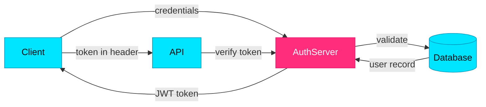

# Auth Patterns

## Authentication Flow

```mermaid
graph LR
  Client:::cyan -->|credentials| AuthServer:::pink
  AuthServer -->|validate| DB[(Database)]:::cyan
  DB -->|user record| AuthServer
  AuthServer -->|JWT token| Client
  Client -->|token in header| API:::cyan
  API -->|verify token| AuthServer
  classDef cyan fill:#00e5ff,stroke:#0099bf,color:#0a0a0f
  classDef pink fill:#ff2d7b,stroke:#e61a6e,color:#fff
```
