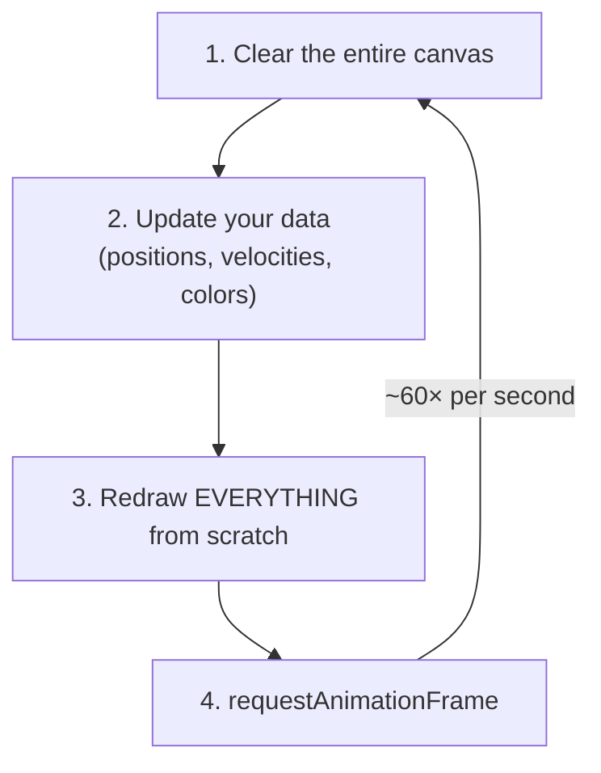
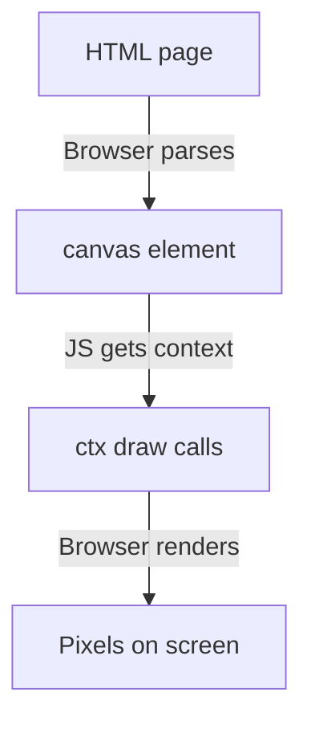
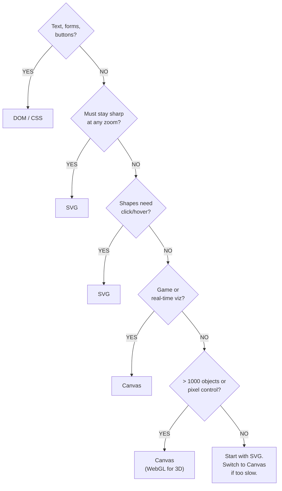

import CanvasRender from '../../../components/canvas-lab/CanvasRender.astro';
import Concept from '../../../components/canvas-lab/Concept.astro';
import LessonNav from '../../../components/canvas-lab/LessonNav.astro';
import LessonHeader from '../../../components/canvas-lab/LessonHeader.astro';

<LessonHeader number={0} />

## Welcome to Canvas

By the end of this course, you will be able to draw shapes, render text, build animations, respond to mouse clicks, manipulate individual pixels, and create things like games, data visualizations, and generative art, all inside a web browser, with nothing but JavaScript.

That might sound ambitious, but it all starts with a single HTML element: <code>&lt;canvas&gt;</code>. It is a programmable rectangle of pixels, a blank surface that does nothing on its own but becomes anything you want once you write code to draw on it.

This lesson covers the <strong>concepts</strong> you need before writing any drawing code. Think of it as the theory chapter: the "why" and "how it works" before the "let's build." If you are the kind of person who likes to jump straight into code, you can skip to <a href="/wiki/canvas-lab/01-basics">Lesson 1</a>. But if you want to truly understand what you are doing (and avoid common confusion later), read on.

<Concept>

<strong>A bit of history:</strong> Canvas was invented by Apple in 2004 for their macOS Dashboard widgets and the Safari browser. Under the hood, it exposed the Mac's powerful Quartz graphics engine to JavaScript. Firefox adopted it in 2005, Opera followed, and by the time HTML5 became a formal W3C standard in 2014, Canvas had already been universally supported for years. Today every browser supports it, desktop and mobile alike. You could say Canvas is old enough to have a driver's license, and it is still the go-to tool for custom graphics on the web.

</Concept>

## What Even IS a Pixel?

Before we talk about drawing, let's talk about what we are drawing <em>on</em>. Your screen is a giant grid of tiny colored dots called <strong>pixels</strong> (short for "picture elements"). Each pixel can be exactly one color at a time. A typical 1920×1080 screen has over two million of these dots, packed so tightly they look smooth to your eye.

<Concept>

<strong>Think of it like this:</strong> imagine a huge sheet of graph paper where every tiny square can be colored in. That is your screen. Each square is one pixel. When you "draw" on a computer, you are really just telling the computer which squares to color and what color to make them.

<pre>{`    Each square = one pixel
    ┌───┬───┬───┬───┬───┬───┬───┬───┐
    │   │   │ ■ │ ■ │ ■ │ ■ │   │   │
    ├───┼───┼───┼───┼───┼───┼───┼───┤
    │   │ ■ │   │   │   │   │ ■ │   │
    ├───┼───┼───┼───┼───┼───┼───┼───┤
    │ ■ │   │ ■ │   │   │ ■ │   │ ■ │
    ├───┼───┼───┼───┼───┼───┼───┼───┤
    │ ■ │   │   │   │   │   │   │ ■ │
    ├───┼───┼───┼───┼───┼───┼───┼───┤
    │ ■ │   │ ■ │   │   │ ■ │   │ ■ │
    ├───┼───┼───┼───┼───┼───┼───┼───┤
    │   │ ■ │   │ ■ │ ■ │   │ ■ │   │
    ├───┼───┼───┼───┼───┼───┼───┼───┤
    │   │   │ ■ │ ■ │ ■ │ ■ │   │   │
    └───┴───┴───┴───┴───┴───┴───┴───┘
    A smiley face, 8 pixels wide!`}</pre>
</Concept>

Every color on your screen is made from a combination of <strong>red, green, and blue</strong> light (RGB). Each pixel has three tiny sub-pixels, one red, one green, one blue, and by varying their brightness, the screen produces any color. Pure red means the red sub-pixel is fully on and the others are off. White means all three are fully on. Black means all three are off.

Canvas gives you direct control over a rectangle of these pixels inside your web page. Unlike most HTML elements (buttons, paragraphs, images), which the browser figures out how to display, Canvas is a <strong>blank slate</strong>; nothing appears until you write code that says what to draw.

## The &lt;canvas&gt; HTML Element

In HTML, you create a drawing surface with the <code>&lt;canvas&gt;</code> tag:

<Concept>
<pre>{`    <canvas id="myCanvas" width="500" height="400"></canvas>

    ┌──────── id ─────────┐
    │  A unique name so   │
    │  JavaScript can     │
    │  find this element  │
    └─────────────────────┘

    ┌── width & height ───┐
    │  How many pixels    │
    │  wide and tall the  │
    │  drawing surface is │
    └─────────────────────┘`}</pre>
</Concept>

A <code>&lt;canvas&gt;</code> element is fundamentally different from other HTML elements:

<ul>
  <li><strong>A &lt;div&gt;</strong> is a container: it holds text, images, and other elements. The browser handles layout automatically.</li>
  <li><strong>An &lt;img&gt;</strong> displays a pre-made image file. You point it at a .png or .jpg and the browser shows it.</li>
  <li><strong>An &lt;svg&gt;</strong> describes shapes using markup: circles, rectangles, paths. Each shape is a real element the browser tracks.</li>
  <li><strong>A &lt;canvas&gt;</strong> is a <em>blank bitmap</em>. It starts as a rectangle of transparent pixels. Nothing appears until you write JavaScript that paints onto it.</li>
</ul>

<Concept>

<strong>Analogy:</strong> If a <code>&lt;div&gt;</code> is a bulletin board where you pin notes and the board remembers each note, then a <code>&lt;canvas&gt;</code> is a whiteboard. You draw on it with markers, and the surface has no idea what a "note" is. It just has colored ink on it.

</Concept>

If you put a <code>&lt;canvas&gt;</code> tag in your HTML and do nothing else, you will see... nothing. Just an invisible rectangle taking up space. The magic happens when JavaScript starts giving it drawing commands.

## The Rendering Context: Your Paintbrush

The <code>&lt;canvas&gt;</code> element itself is just a container, a blank rectangle in your HTML. It cannot draw anything on its own. To actually put pixels on the screen, you need a <strong>rendering context</strong>. You get one by calling:

<Concept>
<pre>{`
    var canvas = document.getElementById('myCanvas');
    var ctx = canvas.getContext('2d');
    //  ^^^                    ^^^^
    //  This variable is       '2d' asks for the 2D drawing API.
    //  your drawing toolkit.  It returns a CanvasRenderingContext2D
    //  By convention we       object: a massive toolkit with
    //  call it "ctx".         dozens of methods and properties.`}</pre>
</Concept>

The <code>ctx</code> object (short for "context") is the single most important object in Canvas programming. It is your paintbrush, your palette, your ruler, and your eraser all rolled into one. <em>Every</em> drawing operation goes through <code>ctx</code>:

<ul>
  <li>Want to draw a rectangle? <code>ctx.fillRect(x, y, width, height)</code></li>
  <li>Want to set a color? <code>ctx.fillStyle = 'red'</code></li>
  <li>Want to draw text? <code>ctx.fillText(text, x, y)</code></li>
  <li>Want to draw a curve? <code>ctx.arc(x, y, radius, startAngle, endAngle)</code></li>
  <li>Want to rotate everything? <code>ctx.rotate(angle)</code> <em>(in radians)</em></li>
  <li>Want to read individual pixels? <code>ctx.getImageData(x, y, width, height)</code></li>
</ul>

<Concept>

<strong>Analogy:</strong> If the <code>&lt;canvas&gt;</code> element is a physical canvas (the fabric stretched over a frame), then <code>ctx</code> is the entire art supply kit sitting next to it: brushes, paints, pencils, erasers, rulers, stencils. The canvas just sits there. The context does all the work.

</Concept>

### Other Rendering Contexts

The <code>'2d'</code> context is what we will use throughout this course, but it is not the only option. When you call <code>getContext()</code>, you can request different types:

<Concept>
<pre>{`    Context Type          What It Does
    ───────────────────── ──────────────────────────────────
    '2d'                  2D drawing: shapes, text, images,
                          gradients. This is what we use.

    'webgl'               3D graphics via OpenGL ES 2.0.
                          Used for 3D games and visualizations.

    'webgl2'              3D graphics via OpenGL ES 3.0.
                          More features than webgl.

    'webgpu'              Next-gen GPU access (newer API).
                          Maximum performance for 3D/compute.

    'bitmaprenderer'      Efficiently displays an ImageBitmap.
                          Used for transferring images between
                          canvases or from workers.`}</pre>
</Concept>

A canvas can only have <strong>one</strong> context at a time. Once you call <code>getContext('2d')</code>, that canvas is locked to 2D; calling <code>getContext('webgl')</code> on the same canvas returns <code>null</code>. For this entire course, <code>'2d'</code> is all you need.

<Concept>

<strong>A note about the demos on this site:</strong> Every interactive code box on this site already has <code>canvas</code> and <code>ctx</code> set up for you behind the scenes. So when you see demo code that starts with <code>ctx.fillRect(...)</code>, it is not missing anything; the boilerplate (<code>getElementById</code>, <code>getContext</code>) has already been done. In your own projects, you will always need to write those two setup lines yourself.

</Concept>

## Your First Lines of Code

Now that you know what <code>ctx</code> is, let's see it in action. This demo draws a colored rectangle, a circle, and some text -- with annotations explaining each line:

export const helloWorldCode = `// --- STEP 1: Draw a filled rectangle ---

// Set the fill color to a nice cyan
ctx.fillStyle = 'cyan';

// Draw a rectangle: x=40, y=40, width=200, height=100
// (40 pixels from the left, 40 from the top)
ctx.fillRect(40, 40, 200, 100);

// --- STEP 2: Draw a circle ---

// Tell ctx we're starting a new shape (a "path")
ctx.beginPath();

// Draw a circle: center at (350, 90), radius 60
// 0 to Math.PI*2 means a full circle (360 degrees)
ctx.arc(350, 90, 60, 0, Math.PI * 2);

// Set fill color to magenta and fill the circle
ctx.fillStyle = 'deeppink';
ctx.fill();

// --- STEP 3: Add some text ---

ctx.fillStyle = 'silver';
ctx.font = 'bold 16px monospace';
ctx.fillText('fillRect()', 85, 95);
ctx.fillText('arc()', 325, 95);

// --- STEP 4: Annotate the coordinates ---

ctx.fillStyle = 'gray';
ctx.font = '12px monospace';
ctx.fillText('x:40 y:40 w:200 h:100', 40, 170);
ctx.fillText('center:(350,90) r:60', 280, 175);

// A small note at the bottom
ctx.fillStyle = 'limegreen';
ctx.font = '14px monospace';
ctx.fillText('A few lines of code is all it takes!', 100, 250);`;

<CanvasRender
  id="hello-world"
  title="Hello, Canvas!"
  width={500}
  height={300}
  code={helloWorldCode}
/>

<Concept variant="note">
**Try this:** Change the rectangle's fill color to `'deeppink'` and move the circle by editing its center coordinates in the `ctx.arc()` call. Watch how the coordinate system maps to actual positions on canvas.
</Concept>

A handful of drawing commands to put a rectangle, a circle, and text on screen. Do not worry about memorizing these methods yet -- you will learn each one in detail starting in Lesson 1. The point here is to see the pattern: set a style, call a draw method, repeat.

## Canvas Size vs CSS Size (A Huge Beginner Pitfall!)

This trips up almost every beginner, so read carefully. A canvas has <strong>two</strong> independent sizes:

<Concept>

<strong>The two sizes of a canvas:</strong>

<pre>{`    1. DRAWING SURFACE (set via HTML attributes)
       width="500" height="400"
       = 500 x 400 pixels of actual drawing space

    2. DISPLAY SIZE (set via CSS)
       style="width: 250px; height: 200px"
       = how big it appears on the page

    If these don't match, your drawing gets STRETCHED:

    Drawing surface: 500x400    CSS display: 250x200
    ┌─────────────────────┐    ┌──────────┐
    │  ●  (perfect circle)│ -->│ ( oval!  │
    │                     │    │    )     │
    │                     │    └──────────┘
    │                     │    Squished to half size!
    └─────────────────────┘

    RULE: Always set size via width/height attributes,
          not CSS, unless you know what you're doing.`}</pre>
</Concept>

Think of it like a photograph: the <strong>resolution</strong> (how many pixels are in the image) and the <strong>print size</strong> (how big you print it on paper) are two different things. Stretching a 100×100 photo to fill a billboard makes it blurry. Same idea with canvas.

export const sizePitfallCode = `// This demo's canvas is 500x200 (the drawing surface).
// The component handles DPI scaling for sharp rendering.

// Draw a perfect circle to prove proportions are correct
ctx.beginPath();
ctx.arc(100, 100, 80, 0, Math.PI * 2);
ctx.strokeStyle = 'cyan';
ctx.lineWidth = 3;
ctx.stroke();

// Label it
ctx.fillStyle = 'gray';
ctx.font = '14px monospace';
ctx.fillText('This is a circle, not an oval.', 200, 95);
ctx.fillText('If it looks round, the canvas', 200, 115);
ctx.fillText('size is set correctly!', 200, 135);`;

<CanvasRender
  id="size-pitfall"
  title="Canvas Size vs CSS Size"
  width={500}
  height={200}
  code={sizePitfallCode}
/>

The default canvas size (if you do not specify width and height) is 300×150 pixels. That is almost never what you want, so always set both attributes explicitly.

## Immediate Mode: Canvas's Superpower (and Quirk)

This is the single most important concept to understand before you start drawing, because it affects <em>everything</em> you do with Canvas.

There are two fundamentally different approaches to computer graphics:

### Retained Mode: The Browser Remembers

This is how the DOM and SVG work. You tell the browser "put a red circle here" and the browser <em>remembers</em> that circle. It creates an internal object for it, stores its properties (position, color, size), and keeps it in a tree of objects. You can change its color later, move it, remove it, or ask "what's at position (100, 50)?" The browser maintains the scene for you.

<Concept>

<strong>Analogy, the magnetic board:</strong> Retained mode is like a magnetic whiteboard with movable magnets. Each magnet is a distinct object. You can pick up the red circle magnet and move it to a new spot. You can remove the blue square magnet. The board "knows" what is on it because each piece is a separate physical thing.

</Concept>

### Immediate Mode: Canvas Forgets

This is how Canvas works. You tell the canvas "paint red pixels in a circle shape here" and those pixels appear. But the canvas <em>immediately forgets</em> what you did. It has no idea there is a "circle"; it just sees colored pixels on a bitmap. Want to move the circle? You have to erase everything and redraw the entire scene with the circle in its new position.

<Concept>

<strong>Analogy, the Etch A Sketch:</strong> Immediate mode is like an Etch A Sketch (or painting with real paint). Once you draw a line, it is just marks on the surface. There is no "line object" you can grab and move. To change anything, you shake the Etch A Sketch (clear the canvas) and redraw from scratch.

</Concept>

Here is a side-by-side comparison of how the two modes handle the same operations:

<Concept>
<pre>{`    RETAINED MODE (DOM / SVG)          IMMEDIATE MODE (Canvas)

    You: "Draw a red circle"           You: "Draw a red circle"
    Browser: "OK, I'll remember        Canvas: "OK, done. Red pixels
     that. Object #47: red circle       are on the bitmap now."
     at position (100, 80)."
                                        You: "Move the circle right"
    You: "Move the circle right"        Canvas: "What circle? I only
    Browser: "Sure, updating             see pixels. You'll have to
     object #47's position."             clear me and redraw."

    You: "What color is it?"            You: "What color is object #47?"
    Browser: "Red. It's object #47."    Canvas: "I don't know what
                                         objects are. I'm just pixels."`}</pre>
</Concept>

### Why Would You Want Something That Forgets?

It might sound like a disadvantage. Why would you want something that forgets? The answer is <strong>performance and simplicity</strong>.

Because Canvas does not maintain a scene graph (an internal tree of objects), it does not slow down as you draw more things. Drawing 10 circles and drawing 10,000 circles uses the same canvas memory; the bitmap is a fixed size regardless. Your JavaScript data (positions, velocities) still takes memory, but without the per-object DOM bookkeeping overhead. The canvas does not care how many "objects" are in your scene. It just has a bitmap of pixels, and each drawing call splatters some new color onto that bitmap.

In retained mode, every object you add consumes memory and processing time. The browser must track each one, run layout calculations, handle event listeners, and update the display when any property changes. With 50 objects, this is fine. With 50,000 objects (like particles in a fireworks simulation), retained mode chokes. Canvas handles it effortlessly.

<Concept>

<strong>The trade-off at a glance:</strong>

| | Retained Mode (DOM / SVG) | Immediate Mode (Canvas) |
|---|---|---|
| **Memory** | Browser remembers every object | You draw, canvas forgets |
| **Mutation** | Easy to move, remove, restyle | Must clear and redraw everything each frame |
| **Performance** | Gets slow with many objects | Handles thousands of "objects" easily |
| **Events** | Built-in click/hover events | You must implement your own hit detection |
| **Best for** | UI, documents, icons | Games, simulations, data viz, pixel effects |
</Concept>

### Your Code Runs Once, Pixels Stay Forever

Before we look at the animation loop, one detail trips up almost every newcomer: Canvas does <strong>not</strong> run your drawing code repeatedly on its own. There is no built-in loop, no auto-refresh, no automatic per-frame redraw. Your script executes top to bottom like any other JavaScript, and whatever pixels end up on the canvas simply sit there.

<Concept>
<pre>{`
    var ctx = canvas.getContext('2d');
    //                ^
    //  Called ONCE when your program starts.
    //  Returns a reference you reuse for ALL
    //  drawing calls. You do NOT call this
    //  every frame.

    ctx.fillRect(10, 10, 50, 50);
    //  ^
    //  Executes IMMEDIATELY on this line.
    //  The browser writes pixels to the canvas
    //  bitmap right here, then moves to the
    //  next line of JavaScript. Those pixels
    //  now sit on the bitmap until something
    //  clears or overwrites them.

    // If your script ends here, the rectangle
    // is on screen FOREVER (or until reload).
    // The canvas does nothing on its own.`}</pre>
</Concept>

Think of drawing with a pen on paper. You draw a line, the ink stays put, the paper does not redraw it on its own. Canvas works the same way: each call to <code>ctx.fillRect()</code>, <code>ctx.arc()</code>, or any other drawing method is a single, instant action. Pixels go down. Done. Until you do something else, that is what stays on screen.

So how do you get motion? You build a flip-book by hand. You write a function that clears the canvas, draws the next slightly-different state, and asks the browser to call you again before the next screen refresh. The browser provides a scheduling helper called <code>requestAnimationFrame</code> that does exactly that, firing about 60 times per second. YOU write the function. Canvas just provides the bitmap to paint on.

<Concept variant="note">
**The mental shift:** A game engine pushes frames at you automatically; you write a `draw()` method and the engine calls it. Canvas does the opposite: it gives you a blank bitmap and stays silent. If you want anything to happen after the first paint, you have to schedule it yourself. We cover the full loop in Lesson 6, but the pattern is laid out next.
</Concept>

### What This Means in Practice

When you build animations or interactive graphics with Canvas, your code follows a simple loop:

Every frame is like a fresh painting on a clean canvas. This might seem wasteful, but modern computers can draw thousands of shapes in a single frame (1/60th of a second). And because canvas has no bookkeeping overhead, each frame is fast and predictable.

The <code>requestAnimationFrame</code> function mentioned in step 4 is a browser API that tells the browser "call my drawing function before the next screen refresh." It is the standard way to create smooth animations; the browser handles timing so your animation runs at the optimal frame rate (usually 60 fps). You will use it extensively starting in Lesson 6.

## The Rendering Pipeline

When you call a drawing method like <code>ctx.fillRect()</code>, what actually happens? Here is the journey from your JavaScript code to visible pixels:

In code, that pipeline looks like this:

<ol>
  <li><code>&lt;canvas id="c" width="500" height="400"&gt;&lt;/canvas&gt;</code>, the HTML creates the blank bitmap</li>
  <li><code>var canvas = document.getElementById('c');</code>, JavaScript grabs a reference to it</li>
  <li><code>var ctx = canvas.getContext('2d');</code>, you get the 2D drawing context</li>
  <li><code>ctx.fillRect(10, 10, 100, 80);</code>, you issue drawing commands that change pixels</li>
</ol>

Behind the scenes, the browser may use GPU hardware acceleration to execute your drawing commands quickly. Modern browsers are surprisingly efficient; a simple <code>fillRect</code> call might be translated into a GPU texture operation that completes in microseconds.

<Concept>

<strong>Key point:</strong> Drawing commands execute <em>immediately</em>. When <code>ctx.fillRect()</code> returns, those pixels are already on the canvas bitmap. There is no "render later" step for basic drawing. (Animation is different; we use <code>requestAnimationFrame</code> to time our redraws, but each individual draw call is instant.)

</Concept>

## Canvas vs SVG vs DOM

The web gives you three main ways to draw things visually. Understanding when to use each one will save you from picking the wrong tool for the job.

### DOM / CSS

The Document Object Model is the standard way web pages work. You write HTML elements (<code>&lt;div&gt;</code>, <code>&lt;p&gt;</code>, <code>&lt;button&gt;</code>), style them with CSS, and the browser handles layout, text wrapping, scrolling, accessibility, and user interaction. This is the right tool for documents, forms, navigation bars, anything text-heavy or interactive in a standard UI way.

### SVG (Scalable Vector Graphics)

SVG lets you describe shapes in XML markup: circles, rectangles, paths, text. Each shape becomes a real DOM element the browser tracks. You can style SVG with CSS, animate it with CSS transitions, and attach click handlers to individual shapes. SVG is resolution-independent: it stays sharp at any zoom level. This is ideal for icons, logos, charts with relatively few elements, and interactive diagrams.

### Canvas

Canvas gives you a blank bitmap and a JavaScript API to paint onto it. It is the raw-performance option: no objects, no DOM nodes, just pixels. You manage everything yourself: what to draw, when to redraw, how to detect clicks. This is the right tool for games, particle systems, image processing, real-time data visualization, and anything with thousands of moving elements.

<Concept>

| | DOM / CSS | SVG | Canvas |
|---|---|---|---|
| **What it is** | HTML elements styled with CSS | Vector shapes described in XML | Pixel bitmap drawn via JS |
| **Rendering model** | Retained mode (browser keeps a tree of elements) | Retained mode (browser keeps a tree of shapes) | Immediate mode (you draw, it forgets) |
| **Scales at zoom?** | Text reflows, layout adapts | Any size; stays crisp | Fixed pixels; can get blurry |
| **Object count** | Dozens of animated items | Hundreds of shapes | Thousands to millions |
| **Built-in events?** | Yes (click, hover, etc.) | Yes (click, hover, etc.) | No; you must do hit-testing |
| **Accessibility** | Excellent (semantic HTML) | Good (titles, desc, ARIA) | Poor (opaque bitmap) |
| **Best for** | UI, layouts, text-heavy pages | Icons, logos, charts, maps, diagrams | Games, data viz, pixel effects, animations |
</Concept>

### When to Use Which: A Decision Guide

<Concept>

<strong>An analogy:</strong> Think of DOM/CSS as arranging furniture in a room: you place objects and the browser remembers where everything is. SVG is like putting stickers on a window; each sticker is a distinct object you can peel off or move. Canvas is like spray-painting a wall; once the paint hits the surface, there are no "objects" anymore, just colored pixels. To change something, you paint over it.

</Concept>

## The Coordinate System

Every drawing command needs to know <em>where</em> to draw. Canvas uses a coordinate system where:

<Concept>

<strong>How Canvas coordinates work:</strong>

<pre>{`    (0,0) ──── X increases ────> (500,0)
      │
      │
      Y increases
      │
      │
      v
    (0,400)                      (500,400)

    IMPORTANT: Y goes DOWN, not up!
    This is opposite to math class.

    (0,0) is the TOP-LEFT corner.
    (500,400) is the BOTTOM-RIGHT corner
    (for a 500x400 canvas).`}</pre>
</Concept>

If you have ever used a spreadsheet, it is the same idea: row 1 is at the top, and higher row numbers go further down. Column A is on the left, and later columns go further right.

This "Y goes down" convention trips up nearly everyone who has taken a math class where Y goes up. It comes from how old computer monitors drew pixels, starting at the top-left and scanning rightward, row by row, top to bottom. The convention stuck, and virtually every 2D graphics system (not just Canvas) uses it.

<Concept>
**"But wait, why does Y go DOWN?!"**

Blame the typewriter. Seriously.

In the 1870s, typewriters printed left to right, then rolled the paper *up* so the next line appeared *below*. Top to bottom. Teletypes (1900s) copied this because they were literally electric typewriters connected to a wire. When CRT monitors replaced paper in the 1950s, they borrowed from TV: an electron beam sweeps left to right, top to bottom, one row at a time. The first pixel on screen was always the top left one.

Then came framebuffers (1970s): a block of memory where byte 0 = top left pixel, and each subsequent byte moves right, then down. Address = `y * width + x`. Y=0 meant the top row. This was the simplest mapping because it matched the physical scan order. No math required.

The Xerox Alto (1973) used it. The Macintosh (1984) used it. X11 and Windows used it. HTML and CSS used it. And when Apple added `<canvas>` in 2004, it inherited the same convention because *everything above it* in the stack was already Y down.

So who uses Y up? Rene Descartes, who invented the coordinate system in 1637 while lying in bed watching a fly on his ceiling (maybe). He was plotting abstract math on paper, where "more" naturally goes upward (like stacking things). He had no pixels to scan. OpenGL (1992) followed Descartes because its users were scientists who'd spent years with Y up in university and would riot otherwise.

Our reality: Canvas Y down comes from 130 years of machines that print top to bottom. Math Y up comes from a 17th century Frenchman watching a bug. Both are perfectly logical. They just never expected to meet inside a `<script>` tag.

**The family tree:**

<pre>{`    Descartes (1637):           Typewriter (1870s):
    "Y goes up because          "Y goes down because
     more is up, obviously."     that's how paper feeds."
            │                           │
            ▼                           ▼
       OpenGL (1992)              Every screen ever
       Scientific viz              ▼
                              Canvas (2004)
                              "Don't look at me,
                               I just work here."`}</pre>
</Concept>

One detail worth noting: coordinates do not have to be whole numbers. You can draw at position <code>(100.5, 75.3)</code>, and the browser will use <strong>anti-aliasing</strong> (blending neighboring pixels) to approximate the sub-pixel position. This is useful for smooth animations but can cause blurry lines if you are not careful. We will revisit this in later lessons.

export const coordsCode = `// --- STEP 1: Draw a background grid ---
ctx.strokeStyle = '#1a1a2a';
ctx.lineWidth = 0.5;

for (var x = 50; x < 500; x += 50) {
  ctx.beginPath();
  ctx.moveTo(x, 0);
  ctx.lineTo(x, 400);
  ctx.stroke();
}
for (var y = 50; y < 400; y += 50) {
  ctx.beginPath();
  ctx.moveTo(0, y);
  ctx.lineTo(500, y);
  ctx.stroke();
}

// --- STEP 2: Draw the X and Y axes ---
ctx.strokeStyle = 'gray';
ctx.lineWidth = 2;

// X axis
ctx.beginPath();
ctx.moveTo(0, 0);
ctx.lineTo(490, 0);
ctx.stroke();
// X arrow
ctx.beginPath();
ctx.moveTo(490, 0);
ctx.lineTo(480, -6);
ctx.moveTo(490, 0);
ctx.lineTo(480, 6);
ctx.stroke();

// Y axis
ctx.beginPath();
ctx.moveTo(0, 0);
ctx.lineTo(0, 390);
ctx.stroke();
// Y arrow
ctx.beginPath();
ctx.moveTo(0, 390);
ctx.lineTo(-6, 380);
ctx.moveTo(0, 390);
ctx.lineTo(6, 380);
ctx.stroke();

// Label axes
ctx.fillStyle = 'gray';
ctx.font = 'bold 14px monospace';
ctx.fillText('X', 480, 20);
ctx.fillText('Y', 10, 395);

// --- STEP 3: Plot some points ---
var points = [
  [0, 0, '(0,0) origin'],
  [200, 100, '(200,100)'],
  [350, 250, '(350,250)'],
  [100, 300, '(100,300)']
];
points.forEach(function(p) {
  ctx.fillStyle = 'deeppink';
  ctx.beginPath();
  ctx.arc(p[0], p[1], 5, 0, Math.PI * 2);
  ctx.fill();

  ctx.fillStyle = 'cyan';
  ctx.font = '13px monospace';
  var labelX = p[0] + 10;
  var labelY = p[1] + 5;
  if (p[0] === 0 && p[1] === 0) { labelX = 8; labelY = 20; }
  ctx.fillText(p[2], labelX, labelY);
});`;

<CanvasRender
  id="coords"
  title="Coordinate System Visualized"
  width={500}
  height={400}
  code={coordsCode}
/>

<Concept>

<strong>Remember:</strong> Coordinates are measured in pixels from the top-left corner. <code>(100, 50)</code> means "100 pixels to the right, 50 pixels down." Later in the course you will learn about <strong>transforms</strong>: you can move the origin, rotate the axes, even flip Y so it goes upward. But the default is always top-left origin, Y-down.

</Concept>

## What Can You Build?

Canvas is not a niche tool; it powers some of the most impressive things on the web. Here is what people build with it in the real world:

<ul>
  <li><strong>Browser Games:</strong> From simple Pong and Snake clones to complex 2D platformers and tower defense games. Frameworks like <strong>Phaser</strong> use Canvas (or WebGL) under the hood. Many popular web games, those .io games you have probably played, are Canvas-based.</li>
  <li><strong>Data Visualization:</strong> Interactive charts, graphs, heatmaps, and dashboards. <strong>Chart.js</strong>, one of the most popular charting libraries on the web, draws everything on Canvas.</li>
  <li><strong>Image Editors:</strong> <strong>Photopea</strong> is a full Photoshop-class image editor that runs entirely in your browser, built on Canvas.</li>
  <li><strong>Creative and Generative Art:</strong> Algorithmic patterns, fractals, particle systems, and interactive installations. Libraries like <strong>p5.js</strong> make Canvas art accessible to beginners.</li>
  <li><strong>Maps:</strong> Google Maps and Mapbox both use Canvas for performance-critical rendering layers.</li>
  <li><strong>Video Processing:</strong> Green-screen effects, live filters, augmented reality overlays: Canvas makes real-time video processing possible in the browser.</li>
  <li><strong>Physics Simulations:</strong> Bouncing balls, cloth simulations, fluid dynamics, gravity demos.</li>
  <li><strong>Digital Signatures:</strong> Those "sign here" pads on delivery apps and online contracts? They often use Canvas to capture your finger or stylus input.</li>
</ul>

<Concept>

<strong>The common thread:</strong> Canvas shines whenever you need to draw something that does not exist as a standard HTML element. Buttons, text paragraphs, and form inputs are built into HTML already. But a scatter plot with 10,000 data points? An animated starfield? A paint program? Those need Canvas.

</Concept>

## The Canvas API at a Glance

The <code>ctx</code> object has a <em>lot</em> of methods and properties. You do not need to learn them all at once; this course covers them lesson by lesson. But it helps to see the big picture so you know what is possible and what is coming:

<Concept>

| Category | Key methods | You'll learn in |
|---|---|---|
| Rectangles | fillRect(x, y, w, h), strokeRect(x, y, w, h), clearRect(x, y, w, h) | Lesson 1 |
| Paths and Shapes | moveTo(x, y), lineTo(x, y), arc(x, y, r, start, end), bezierCurveTo() | Lesson 2 |
| Colors and Styles | fillStyle, strokeStyle, createLinearGradient(x1, y1, x2, y2) | Lessons 1 & 3 |
| Text and Images | fillText(text, x, y), drawImage(img, x, y), getImageData(x, y, w, h) | Lesson 4 |
| Transformations | translate(x, y), rotate(angle), scale(x, y) | Lesson 5 |
| Animation | requestAnimationFrame(callback), the clear-update-draw loop | Lesson 6 |
| Interaction | Mouse/touch events, hit detection | Lesson 7 |
| Particle System | Capstone: combines everything | Lesson 8 |
</Concept>

Notice two things about this roadmap:

<ol>
  <li><strong>Everything goes through <code>ctx</code>.</strong> There is no separate "shapes" object or "text" object. One context does it all.</li>
  <li><strong>The API is low-level.</strong> There is no <code>ctx.drawButton()</code> or <code>ctx.drawChart()</code>. You build complex things from simple primitives: rectangles, lines, arcs, and text. That is what makes Canvas both powerful and fun: you are building from scratch.</li>
</ol>

Do not worry about memorizing any of this. As we work through each lesson, these categories will become second nature. This overview just gives you a mental map so you are never lost.

<Concept>

<strong>What you learned in this lesson:</strong>

<pre>{`    Concept                      Key Takeaway
    ──────────────────────────── ─────────────────────────────────
    Pixels                       Your screen is a grid of tiny
                                 colored dots. Canvas controls a
                                 rectangle of them.

    The <canvas> element         A blank bitmap in HTML. Nothing
                                 appears until JS draws on it.

    The ctx object               Your drawing toolkit. Got via
                                 canvas.getContext('2d'). Every
                                 drawing call goes through it.

    Canvas size vs CSS size      Two independent sizes. Mismatch
                                 = stretched/blurry graphics.
                                 Always set width/height attrs.

    Immediate mode               Canvas forgets what you drew.
                                 No objects; just pixels.
                                 You must redraw every frame.

    Code runs once               Drawing calls execute instantly,
                                 once, like pen on paper. Canvas
                                 has no auto-loop. Animation = you
                                 schedule redraws via rAF.

    The rendering pipeline       HTML -> canvas -> ctx -> pixels.

    Canvas vs SVG vs DOM         DOM for pages, SVG for scalable
                                 vector graphics, Canvas for
                                 raw speed and pixel control.

    The coordinate system        (0,0) is top-left. X goes right.
                                 Y goes DOWN (not up!).

    What you can build           Games, charts, editors, art,
                                 maps, video effects, and more.`}</pre>
</Concept>

You now have the conceptual foundation for everything that follows. Next up: <strong>Lesson 1, Basics</strong>, where you will draw your first rectangles and start building real scenes.

<LessonNav
  next={{ href: "/wiki/canvas-lab/01-basics", title: "Basics" }}
/>
